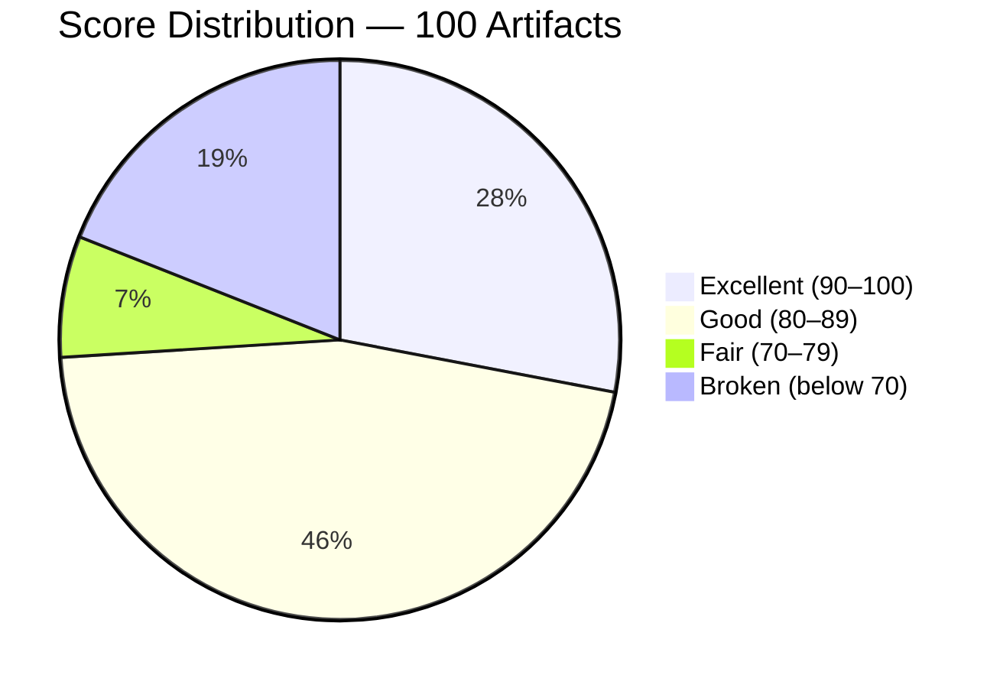
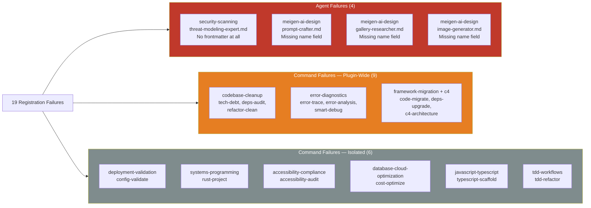
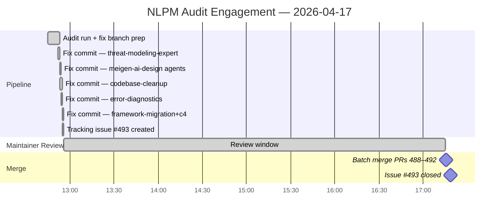

# The Frontmatter Tax: 19 Silent Registration Failures in a 33,000-Star Plugin Collection

> **Disclosure**: This article was generated by an automated pipeline using Claude (Sonnet 4.6) based on audit data and GitHub records. It describes work performed by NLPM tooling maintained by [xiaolai](https://github.com/xiaolai). Readers should weigh claims accordingly. The NLPM pipeline did not request comment from the maintainer before publication.

---

## The Project

[wshobson/agents](https://github.com/wshobson/agents) is a plugin marketplace for Claude Code, described as "intelligent automation and multi-agent orchestration." With 33,794 stars and 3,667 forks, it is one of the most widely referenced Claude Code plugin collections available — the repo many developers land on when they first search for where to start. The repository is maintained by [Seth Hobson](https://github.com/wshobson).

The repo distributes its content as independent plugins — each plugin is a self-contained directory containing agents (`.md` files with YAML frontmatter and behavioral instructions) and commands (slash commands similarly structured). At the time of audit, the repository contained 100 registered artifacts across 40+ plugins: 64 agents and 36 commands.

---

## The Audit

NLPM audited all 100 artifacts on 2026-04-17 using the 100-point NL scoring scale. The overall weighted score was **82 / 100**, placing the repository in the **Gold tier**.

That number, however, conceals a sharp internal divide — less a bell curve than a tale of two codebases.

*Approximate distribution derived from plugin-level averages in the audit report (individual artifact scores were not enumerated for all 100 files).*

The agent portfolio averaged **86 / 100** across 64 agents — a strong result. The command portfolio averaged **74 / 100** across 36 commands, dragged down by a structural problem: 15 of 36 commands had no YAML frontmatter, causing them to silently fail registration. Users installing one of the 9 affected plugins had 0 of their slash commands register. Across the full repo, 15 of 36 commands (41.7%) failed registration — though any given user experienced either complete failure or no failures depending on which plugins they installed, not a probabilistic 40% chance.

The top-performing plugins were `dotnet-contribution` (92), `database-design` (91), `agent-teams` (91), and ten more plugins averaging 90+. Several orchestration commands — `full-stack-feature`, `tdd-cycle`, `performance-optimization` — were standout examples of multi-agent workflow design, with phased execution, interactive Q&A, parallel agent dispatch, and resume capability.

The lowest-scoring plugins were `security-scanning` (55), and six plugins tied at 57: `accessibility-compliance`, `codebase-cleanup`, `database-cloud-optimization`, `javascript-typescript`, `systems-programming`, and `error-diagnostics`. All six scored at 57 for the same mechanical reason: missing YAML frontmatter.

**19 bugs total** were identified: 4 agent registration failures and 15 command registration failures.

Three plugins had every command broken: `codebase-cleanup` (3/3), `error-diagnostics` (3/3), and the combined `framework-migration`/`c4-architecture` group (3/3). One plausible explanation is a batch authoring workflow where frontmatter was added inconsistently — these plugins contain rich, well-developed content (some files are 100–1,000+ lines), suggesting content quality was not the issue. It is unknown whether the affected files predate the Claude Code frontmatter requirement or were authored after it was established.

The security scan found no CRITICAL or HIGH severity issues. One MEDIUM finding: `plugins/protect-mcp/hooks/hooks.json` runs `npx protect-mcp@latest` on every tool call — an intentional security tool but one that downloads and executes npm package code at runtime without a pinned version. Two LOW findings covered the same unpinned dependency and loose version constraints in `requirements.txt`.

---

## What Was Submitted

The NLPM pipeline submitted 5 pull requests targeting the highest-impact registration failures. PR numbers are derived from merge commit messages in the git history; direct PR URLs are constructed from the repository base URL confirmed by those same commits.

| PR | Branch | Bugs Fixed | Artifacts Unblocked |
|----|--------|------------|---------------------|
| [#488](https://github.com/wshobson/agents/pull/488) | `fix/nlpm-threat-modeling-expert-frontmatter` | B-01 | 1 agent |
| [#489](https://github.com/wshobson/agents/pull/489) | `fix/nlpm-meigen-agents-missing-name` | B-02, B-03, B-04 | 3 agents |
| [#490](https://github.com/wshobson/agents/pull/490) | `fix/nlpm-codebase-cleanup-frontmatter` | B-11, B-12, B-13 | 3 commands |
| [#491](https://github.com/wshobson/agents/pull/491) | `fix/nlpm-error-diagnostics-frontmatter` | B-17, B-18, B-19 | 3 commands |
| [#492](https://github.com/wshobson/agents/pull/492) | `fix/nlpm-framework-migration-frontmatter` | B-06, B-08, B-09 | 3 commands |

Each PR made one category of mechanical fix: either adding YAML frontmatter where none existed, or adding a `name:` field to frontmatter that was otherwise complete — three agents fully described, just never introduced. No content was altered. The fixes covered 13 of 19 identified bugs, unblocking 13 artifacts from registration failure.

Six bugs were raised in the tracking issue but not addressed by a PR: `config-validate` (deployment-validation), `rust-project` (systems-programming), `accessibility-audit` (accessibility-compliance), `cost-optimize` (database-cloud-optimization), `typescript-scaffold` (javascript-typescript), and `tdd-refactor` (tdd-workflows).

A parallel issue was raised for tracking: [#493](https://github.com/wshobson/agents/issues/493) — "NLPM audit: 19 registration failures across 9 plugins (15 commands + 4 agents)".

*Note: `prs.json` in the evidence set was empty at collection time, suggesting PR records were fetched after all PRs had already merged. PR details above are reconstructed from merge commits in `commits.json`.*

---

## The Response

All five PRs were merged on the same day they were submitted.

The merge timestamps tell the story most directly:

- PR #488 merged: `2026-04-17T17:15:22Z`
- PR #489 merged: `2026-04-17T17:15:24Z`
- PR #490 merged: `2026-04-17T17:15:28Z`
- PR #491 merged: `2026-04-17T17:15:32Z`
- PR #492 merged: `2026-04-17T17:15:34Z`

Five PRs merged in 12 seconds. Issue #493 closed three minutes later at `17:18:07Z`. Faster than most developers read a single diff.

No maintainer review comments are present in the evidence. Either the PRs were merged without comment, or comment records were not captured. The mechanical nature of the fixes — adding frontmatter to files that had none — likely reduced friction: there was little to dispute. When the fix is five lines of YAML, arguments tend to be brief.

The evidence also contains three earlier commits co-authored with Claude that predate this audit:

- `2026-04-03`: "fix: add marketplace.json entry, remove phantom validator reference" ([commit](https://github.com/wshobson/agents/commit/1925457552d8f91e609ceef13764c443b3ef85be)) — co-authored by Claude Sonnet 4.6
- `2026-04-15`: "fix: monte carlo layer uses nonexistent sdk.stream() instead of sdk.query()" ([commit](https://github.com/wshobson/agents/commit/6fdefba05df04fda3fa8fd713e7fe499821d6135)) — co-authored by Claude Opus 4.6, fixing a bug that caused every simulation to report 100% failure rate

These suggest a prior working relationship with AI-assisted contributions. One might speculate that this familiarity lowered the threshold for accepting automated PRs, but that cannot be inferred from the data alone.

---

## What the Audit Revealed

**The frontmatter problem is structural, not careless.** The 15 broken commands all contain well-developed content. Some are among the longer files in the repo. The pattern points to a batch authoring workflow where frontmatter was added as an afterthought — or not at all — rather than as part of the file template, the way a file cabinet fills with documents before anyone designs a folder structure. This is a tooling gap, not a quality gap in the underlying content.

**There is a sharp two-speed pattern in the command portfolio.** The five orchestration commands that use phased execution with checkpoints (`full-stack-feature`, `tdd-cycle`, `performance-optimization`, `tdd-red`, `tdd-green`) represent some of the highest-quality Claude Code command design the audit encountered anywhere. The contrast with 15 commands that cannot even register is stark — like a stage company where half the cast arrived in full costume and the other half couldn't get through the door. The repo appears to have two distinct authoring generations.

**Agent duplication creates a maintenance tradeoff.** Three agents exist verbatim in two locations each:

- `comprehensive-review/agents/security-auditor.md` → `security-scanning/agents/security-auditor.md`
- `comprehensive-review/agents/code-reviewer.md` → `code-documentation/agents/code-reviewer.md`
- `performance-testing-review/agents/performance-engineer.md` → `observability-monitoring/agents/performance-engineer.md`

Any update to one must be manually mirrored to the other — a standing bet that two copies of the same truth will stay synchronized indefinitely. As a distributed plugin repo this is particularly risky: users installing individual plugins receive different versions with no mechanism to detect drift. Duplication may also be intentional for independent plugin installation — the tradeoff is maintenance overhead versus avoiding cross-plugin dependencies.

**The `allowed-tools` gap is repo-wide.** Only `startup-business-analyst` (the highest-scoring command plugin) properly declares `allowed-tools` on its commands. All other command plugins omit it. NLPM recommends explicit `allowed-tools` declarations for least-privilege hygiene, though omitting them may be intentional for agents and commands that legitimately need broad tool access — this is a design recommendation, not a structural bug.

**Fairness note.** An 82/100 Gold-tier score across 100 artifacts in a large, community-contributed plugin marketplace is a strong result — not a participation trophy, but a grade that reflects genuine craft distributed across a wide surface area. The structural issues identified here — missing frontmatter, duplicate agents, missing `allowed-tools` — are all mechanical and fixable. The underlying capability design (model tier selection, output format specification, example interactions) is genuinely good throughout the agent portfolio.

---

## Timeline

Total elapsed time from first fix commit to issue closure: **4 hours 26 minutes** (12:52 to 17:18:07). The Gantt chart above measures from issue creation at 12:56 to the batch merge at 17:15 — a slightly different window.

---

## Limitations

**No PR review comments in evidence.** The `pr-*-reviews.json` files listed in the audit prompt template were absent from the evidence set. We cannot confirm what (if any) review discussion occurred before the batch merge. The absence of review comments and 12-second merge window are consistent with minimal per-PR review, but other explanations exist — including an automated merge pipeline (common in repos with trusted-reviewer bots or CI automerge configurations) or local review not captured in the evidence.

**prs.json was empty.** PR metadata was not captured, likely because all PRs had already merged by collection time. PR details in this article are reconstructed from commit messages and may omit information present only in PR descriptions or comments.

**13 of 19 bugs addressed.** The NLPM pipeline submitted PRs for 13 bugs across 5 PRs. The remaining 6 bugs (all isolated command-level frontmatter failures) were documented in the tracking issue but not patched. It is unknown whether the maintainer plans to address these independently.

**Score approximation.** The mermaid pie chart uses estimated per-artifact score distributions derived from plugin-level averages. The audit report does not enumerate individual scores for all 100 artifacts.

**Merge speed does not imply review depth.** Five PRs merged in 12 seconds may indicate the maintainer spot-checked rather than fully reviewed each diff. The fixes were mechanical, but the merge pattern cannot be taken as evidence of a thorough review process.

---

## Significance

wshobson/agents demonstrates a pattern likely to recur across large, actively maintained plugin collections: the authoring effort concentrates on behavioral instructions (which are hard) while infrastructure metadata (which is mechanical) gets added inconsistently — the way paint goes on last and sometimes doesn't reach the back of the fence. At 33,794 stars, the repo has significant distribution — users who installed affected plugins had some or all of their commands fail to register, with no diagnostic to point them at the cause.

Thirteen artifacts that previously could not register in Claude Code were patched and accepted within the same business day.

The more interesting signal is what the audit did not find: the behavioral quality of the agent portfolio is genuinely strong. Model tier assignments are appropriate, output formats are well-specified, and several orchestration commands represent real craft. The structural failures were a thin layer over a solid foundation — a missing nameplate on a building that was otherwise well-constructed and fully occupied.
