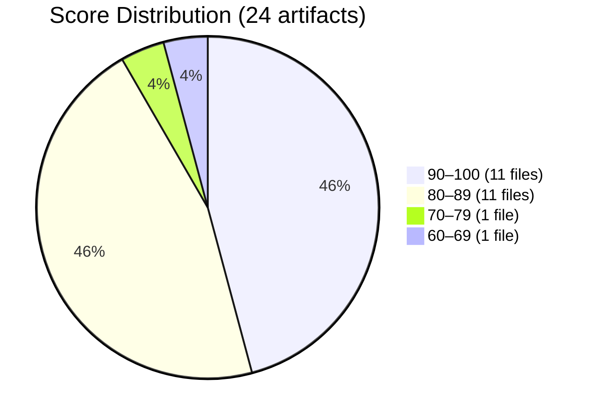
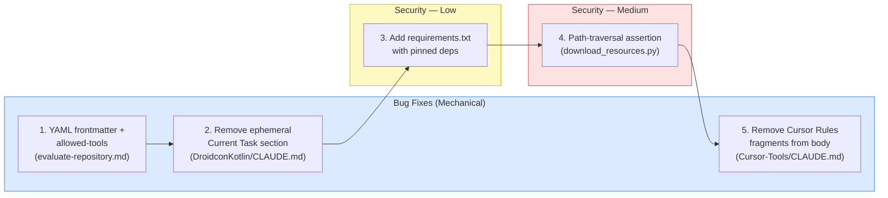
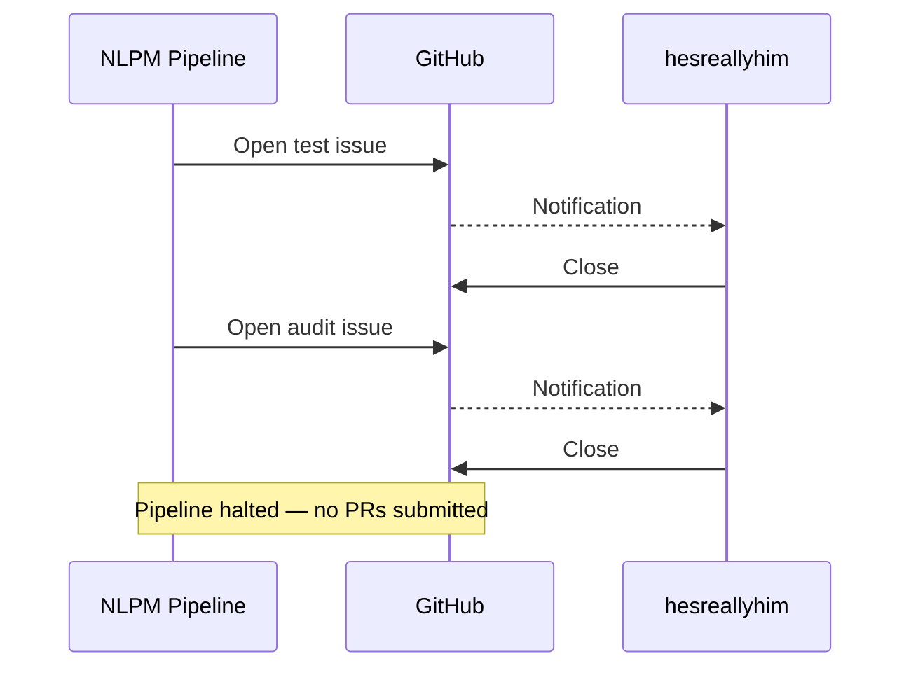
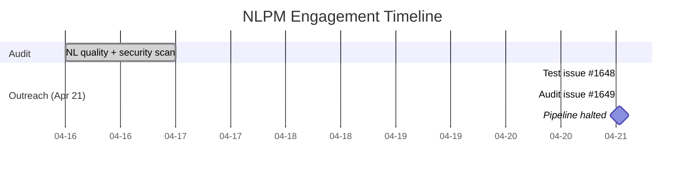

# When the Curator Gets Curated: Closed in Ten Seconds

> **Disclosure**: This article was generated by an automated pipeline using Claude (Sonnet 4.6) based on audit data and GitHub records. It describes work performed by NLPM tooling maintained by [xiaolai](https://github.com/xiaolai). Readers should weigh claims accordingly.

---

## The Project

[hesreallyhim/awesome-claude-code](https://github.com/hesreallyhim/awesome-claude-code) is a curated list of skills, hooks, slash-commands, agent orchestrators, applications, and plugins for Claude Code by Anthropic. Maintained by [Really Him](https://github.com/hesreallyhim), it has accumulated **40,231 stars** and 3,326 forks — one of the most-watched Claude Code community resources on GitHub.

This repo does not implement anything. It collects. Its primary NL artifact — a custom Claude Code command — automates the evaluation of other repositories. Its remaining 23 audited artifacts are CLAUDE.md files gathered from external projects and stored under `resources/claude.md-files/` as community reference examples. Auditing it is a bit like reviewing the reviewer — reaching for the red pen only to discover the reviewer isn't home.

---

## The Audit

**Date**: 2026-04-16 | **Artifacts**: 24 | **Strategy**: batched

**NL Score: 89/100** | **Security: CLEAR**

The distribution is bimodal: nearly every artifact clusters at either "good" (80–89) or "excellent" (90–100), with one file at each tail — the outliers are where the story lives.

- **Lowest**: `.claude/commands/evaluate-repository.md` scored **62/100** — the repo's own command, missing YAML frontmatter and an `allowed-tools` declaration, plus eight vague-quantifier hits.
- **Highest**: `resources/claude.md-files/Guitar/CLAUDE.md` scored **100/100** — no findings.

**Top issues by category:**

| Category | Count | Examples |
|----------|-------|---------|
| Vague quantifiers | 14 | "appropriate" across 6 files, "comprehensive" ×3, "concise" ×4 |
| Ephemeral state in context files | 2 | "Current Task: Cleaning up app for release" (DroidconKotlin); implementation notes (Network-Chronicles) |
| Structural gaps | 2 | Missing build/test commands (AVS-Vibe-Developer-Guide, Note-Companion) |
| Instruction-override language | 2 | "supersede any conflicting instructions" (claude-code-mcp-enhanced); permission-expansion (Cursor-Tools) |
| Malformed embedded syntax | 1 | Cursor Rules frontmatter fragments in Cursor-Tools/CLAUDE.md body prose |

A fairness note: 23 of 24 files were authored by external developers and gathered, not written, by this maintainer. The quality issues in those files reflect upstream choices. The one artifact fully under the maintainer's control scored lowest — the sort of irony that needs no footnote.

**Security findings:**

| Severity | Count |
|----------|-------|
| Critical | 0 |
| High | 0 |
| Medium | 3 |
| Low | 2 |

All findings are scoped to maintenance scripts (`scripts/`). No hooks, no shell=True subprocess calls, no hardcoded credentials. Security posture is genuinely clean.

---

## What Would Have Been Submitted

No pull requests were submitted to this repository.

The pipeline creates a tracking issue before opening PRs as a notification and circuit-breaker. Both issues opened against this repository were closed before the pipeline could proceed to PR creation. Opening a labeled test issue on a production repo without prior consent may itself be unwelcome, regardless of intent — arriving with a repair estimate before anyone called for service.

| Issue | Title | Created | Closed | Open Duration |
|-------|-------|---------|--------|---------------|
| [#1648](https://github.com/hesreallyhim/awesome-claude-code/issues/1648) | [NLPM Audit] Test issue - please ignore | 2026-04-21 00:38:29Z | 2026-04-21 00:38:37Z | 8 seconds |
| [#1649](https://github.com/hesreallyhim/awesome-claude-code/issues/1649) | [NLPM Audit] Automated quality audit: 4 bugs + 2 security fixes identified | 2026-04-21 00:42:40Z | 2026-04-21 00:42:50Z | 10 seconds |

The four NLPM quality findings identified and the security fixes were never proposed as patches. The planned priority order — had the pipeline proceeded — was:

---

## The Response

Both issues were closed within ten seconds of creation. No comment was left on either. No forwarding address. No commits referencing NLPM or Claude are on record. No pull request reviews exist — no PRs were opened.

Whether these closures were manual or automated is not recorded. The ten-second response time is consistent with both a quick-acting maintainer who was online and a bot configured to close issues from unrecognized senders. The maintainer was not contacted for comment beyond the issue mechanism; the interpretations in this article are based on one-sided evidence.

---

## What the Audit Revealed

**Vague quantifiers are the dominant quality signal in this 24-file sample.** Ten of 14 quality issues involve vague-quantifier hits. The word "appropriate" appeared in six separate files, doing the work that six more specific words might have done. This is an N=24 sample from a curation repo, not a representative cross-section of the Claude Code community — extrapolating to a "community fingerprint" overstates the evidence. The curator reflects the community it documents, but that pattern would need broader sampling to confirm.

**Ephemeral state leaking into committed context files is a recurring failure.** Two files contained clearly transient content: a "Current Task" note about prepping for a release (DroidconKotlin/CLAUDE.md) and implementation-plan notes (Network-Chronicles/CLAUDE.md). CLAUDE.md files persist indefinitely; task context does not. These appear to be development-session artifacts committed without cleanup — like a sticky note left on the wall after the meeting, then photographed into the company handbook.

**The repo's own command underperformed every third-party file it curates.** `evaluate-repository.md` scored 62/100 — below all 23 collected CLAUDE.md files. A command that evaluates other repositories appears in the picker without a description — like a restaurant critic who forgot to sign the reviews. The missing `allowed-tools` declaration means no tool restrictions are enforced during evaluation runs — though for a command designed to evaluate arbitrary repositories, broad tool access may be intentional by design; the absence is undocumented either way. The missing YAML frontmatter reads as a mechanical omission.

**Instruction-override findings should be read with context.** Two files flag override language: "supersede any conflicting instructions" (claude-code-mcp-enhanced) and permission-expansion patterns (Cursor-Tools). These may be deliberate integration choices — system-integration commands can legitimately need to override conflicting defaults. NLPM's override penalty is a heuristic that may not apply cleanly to this class of artifact.

**Security posture is clean — and worth saying plainly.** A clean bill is easier to overlook than a finding. The three medium findings are all scoped to link-validation and resource-download scripts. The low finding (unpinned dependencies) is broadly applicable and low-urgency. No executable hooks, no shell injection vectors, no credential handling.

---

## Timeline

Five days elapsed between audit and outreach — normal batch scheduling lag. Both outreach events resolved in under a minute. The audit took a day; the response took ten seconds.

---

## Limitations

**We do not know who or what closed the issues.** Ten-second closure is consistent with automation, but not exclusively so. No comment was left on either issue.

**Rapid closure does not validate or invalidate the findings.** The four quality gaps and five security findings were identified against the audit evidence. No maintainer feedback was received.

**The audit covered 24 of many more artifacts.** The repo contains substantially more content. 89/100 is a sample estimate, not a whole-repo measurement.

**The collection's quality reflects upstream authors.** Many deductions were for writing choices made by external developers whose files were gathered, not authored, by this maintainer. Judging the curator by the curated requires holding both of those things at once — like grading a librarian on the books she collects, not the ones she wrote.

**Contribution guidelines were not checked — a procedural gap in the pipeline.** A project with 40,231 stars almost certainly has documented policy on automated or bot-submitted issues. The pipeline should have verified contribution guidelines before opening any issues. Rapid closure may reflect that policy being enforced rather than a reaction to the specific findings.

**Curation repos may not be appropriate NLPM targets.** Awesome-lists are architecturally distinct from implementation repos — their "artifacts" are primarily collected from external authors, not authored by the curator. Scoring a collection of contributed files on a rubric designed for owned artifacts conflates curator judgment with upstream author choices. Whether this is a meaningful audit use case is an open question.

---

## Significance

The result here is not a success or failure of the audit process — it is a data point about deployment context.

A maintainer of a 40,000-star project receives significant automated noise. Consistent ten-second closures applied to both a test issue and the substantive audit notification suggest a deliberate policy rather than an oversight. This is a reasonable posture at that scale.

The engagement did not produce its intended outcome — no improvements were made to the target repository, and the contribution path was blocked before it could be tested. What the scoring run did confirm is that NLPM can process a heterogeneous curation target — a repo whose NL artifacts span a dozen upstream projects — without special-casing the structure. That is informative for calibration, not a success to report — occasionally, the map improves even when the territory does not.

The four findings identified by NLPM remain unaddressed. The command still lacks frontmatter and `allowed-tools`. DroidconKotlin's CLAUDE.md still contains stale task state. Cursor-Tools still has embedded Cursor Rules fragments. Whether that matters depends on how many of the repo's 40,231 stargazers use those files as templates — a question this audit cannot answer. The letter was delivered. The door was already closed.
