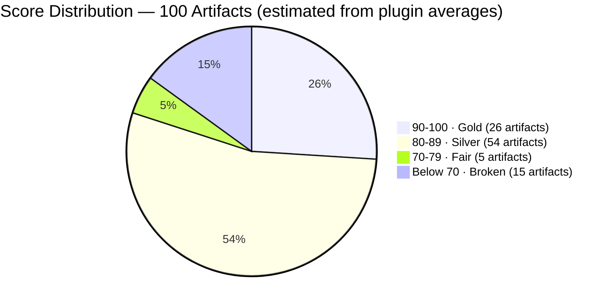
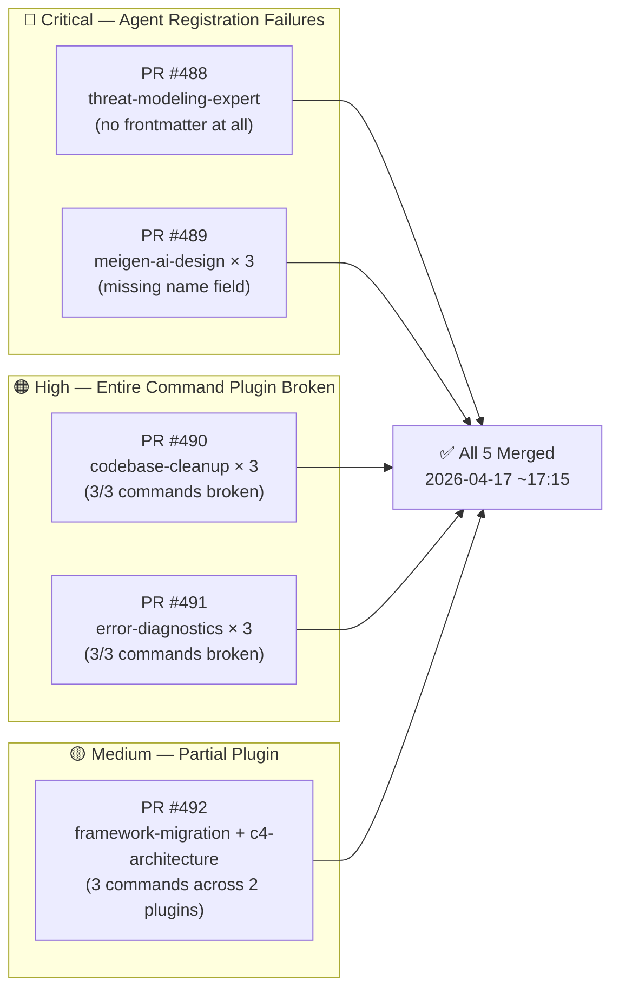
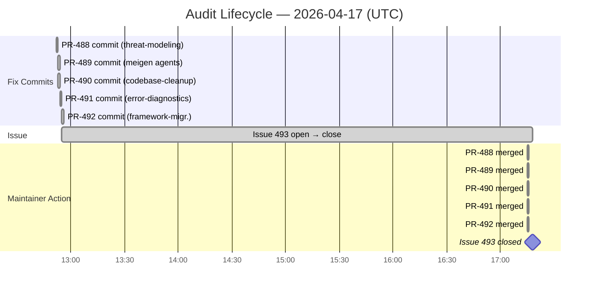

# The Commands That Weren't There: 19 Silent Registration Failures in a 34K-Star Plugin Repo

> **Disclosure**: This article was generated by an automated pipeline using Claude (Sonnet 4.6) based on audit data and GitHub records. It describes work performed by NLPM tooling maintained by [xiaolai](https://github.com/xiaolai). Readers should weigh claims accordingly.

---

## The Project

[wshobson/agents](https://github.com/wshobson/agents), maintained by [Seth Hobson](https://github.com/wshobson), is one of the most widely distributed Claude Code plugin collections available. Described as "intelligent automation and multi-agent orchestration for Claude Code," it packages 100 artifacts — 64 agents and 36 commands — across 40+ independent plugins covering everything from embedded firmware work to JVM language expertise to multi-agent TDD workflows. With **34,093 stars** (indicating high visibility, though not necessarily active use of all plugins) and 3,698 forks at time of data collection, it is frequently the first repository developers encounter when exploring what Claude Code can do beyond its defaults — something of a front door to the ecosystem.

---

## The Audit

NLPM audited all 100 artifacts on 2026-04-17. The overall weighted score was **82 / 100**, placing the repository in the **Gold tier**.

The 82 average is real, but it is a weighted average performing quietly. The agent portfolio averaged **86 / 100** — genuinely strong work. The command portfolio averaged **74 / 100** — above the default 70-point quality threshold — with a handful of excellent orchestration commands but a tail pulled down by completely non-functional ones.

The top of the distribution is legitimate. Plugins like `dotnet-contribution` (92), `agent-teams` (91), and `startup-business-analyst` (90) have rich capability descriptions, appropriate model tier assignments, thorough output formats, and concrete example interactions. The five orchestration commands — `full-stack-feature`, `tdd-cycle`, `performance-optimization`, `tdd-red`, `tdd-green` — represent best-in-class multi-agent workflow design: phased execution with checkpoints, interactive Q&A, parallel agent dispatch, and resume capability.

The bottom of the distribution is a different story — closer to a bridge with a handful of bolts missing than a bridge that needs rebuilding. **19 artifacts — 4 agents and 15 commands — appear to have failed to register.** Claude Code requires YAML frontmatter to identify and load NL artifacts. All 19 affected artifacts had none, or were missing a required field — assuming they are intended to be loadable commands or agents rather than documentation or templates. Users installing the plugin would find roughly one in five artifacts simply absent with no error message — discovered the way you find a hole in your umbrella, by getting rained on.

---

## What Was Submitted

NLPM submitted five pull requests on 2026-04-17 targeting the 19 registration failures. PR numbers are drawn from merge commit messages; PR-level URLs are not available in the evidence record.

**PR #488 — `fix: add missing YAML frontmatter to threat-modeling-expert agent`**
([merge commit](https://github.com/wshobson/agents/commit/8ef279aeda18f28a0a63937cbfeb764a42645fe7))

The `threat-modeling-expert` agent in the `security-scanning` plugin had no YAML frontmatter at all — the file began with a bare `# Threat Modeling Expert` heading. Without `name`, `description`, and `model`, Claude Code cannot identify or load the agent. Score before fix: 20 / 100.

**PR #489 — `fix: add missing name field to all 3 meigen-ai-design agents`**
([merge commit](https://github.com/wshobson/agents/commit/673b90b83253bee3ab09cc5c6d56d7851a9244a8))

All three agents in `meigen-ai-design` (`prompt-crafter`, `gallery-researcher`, `image-generator`) had frontmatter blocks but were missing the `name` field — each quietly missing its own introduction. Without a name, Claude Code may not reliably identify the agents — the field is non-canonical and some load paths may fall back to the filename, but the omission is a portability concern. The fix added `name:` derived from each file's filename.

**PR #490 — `fix: add missing YAML frontmatter to codebase-cleanup commands`**
([merge commit](https://github.com/wshobson/agents/commit/53d359d499c605e0add9ac041b5c316f2f561cf6))

All three commands in `codebase-cleanup` (`tech-debt`, `deps-audit`, `refactor-clean`) lacked frontmatter, making the entire plugin non-functional as a slash command set. Each fix added a minimal `description:` block — no content changes.

**PR #491 — `fix: add missing YAML frontmatter to error-diagnostics commands`**
([merge commit](https://github.com/wshobson/agents/commit/5d531af4a0e398c2cac65f9bca1c295cda94d96b))

Same pattern as PR #490: all three commands in `error-diagnostics` (`error-trace`, `error-analysis`, `smart-debug`) missing frontmatter, making the plugin a no-op for users relying on slash commands.

**PR #492 — `fix: add missing YAML frontmatter to framework-migration and c4-architecture commands`**
([merge commit](https://github.com/wshobson/agents/commit/8e40baf81e3077141aac9636f0aea501f9a3a884))

Three commands across two plugins — `code-migrate` and `deps-upgrade` in `framework-migration`, and `c4-architecture` in `c4-architecture` — were missing frontmatter. This PR batched the fixes.

The remaining 6 broken artifacts (affecting `systems-programming`, `accessibility-compliance`, `database-cloud-optimization`, `javascript-typescript`, and `tdd-workflows`) were documented in the audit report but not submitted as PRs in this batch. The 5 submitted PRs covered the clusters where the entire plugin was non-functional.

---

## The Response

No maintainer review comments are available in the evidence record — the PR-level review data was not captured. What the commit record shows is that all five PRs were merged by the maintainer on the same day they were submitted, within the same minute at approximately 17:15 UTC. [Issue #493](https://github.com/wshobson/agents/issues/493), filed to track the 19 registration failures, was closed at 17:18:07 UTC — roughly three minutes after the last merge.

The absence of review comments could mean the fixes were reviewed and found unambiguous, or that the maintainer merged without detailed review. The velocity (five PRs merged within the same minute) is consistent with either rapid review of unambiguous changes or no review. The fixes were mechanical — adding 2-3 lines of YAML to files with no content changes, like attaching address labels to otherwise-packed envelopes — so either reading is defensible.

The commit record also shows two prior Claude-attributed commits in the repository:
- [2026-04-15](https://github.com/wshobson/agents/commit/6fdefba05df04fda3fa8fd713e7fe499821d6135): A bug fix credited to "Claude Opus 4.6" correcting a `sdk.stream()` call to `sdk.query()` in a Monte Carlo simulation layer.
- [2026-04-03](https://github.com/wshobson/agents/commit/1925457552d8f91e609ceef13764c443b3ef85be): A marketplace.json fix credited to "Claude Sonnet 4.6".

These show two prior AI-attributed commits in this repository, indicating familiarity with AI-assisted contributions.

---

## What the Audit Revealed

**The frontmatter gap is a batch authoring artifact.** The 19 broken files are not thin or low-effort — many are 100 to 1000+ lines of carefully written content, with detailed examples, phased workflows, and domain-specific knowledge. They were simply never wrapped in the 3-line YAML block that Claude Code requires to load them — books written in full but never given a spine the catalog could read. The audit report notes the most likely cause: a batch authoring workflow where frontmatter was added inconsistently across the plugin set.

**The failure clusters by plugin, not randomly.** Three plugins had 100% command failure rates: `codebase-cleanup` (3/3 broken), `error-diagnostics` (3/3 broken), and `meigen-ai-design` (3/3 agents broken with the same missing `name` field). This is not random noise — it is a pattern suggesting these plugins were authored in one session without a frontmatter pass at the end. The content arrived; the envelope did not.

**The quality gap between agents and commands is real.** The agent portfolio (86/100 average) consistently demonstrates best practices: model tier selection, capability examples, output format specifications. The command portfolio (74/100) has two populations: a handful of excellent orchestration commands and a large tail of content-rich but registration-broken slash commands. The `startup-business-analyst` plugin stands as the exception — the only non-orchestration plugin to declare `allowed-tools` on its commands, earning the highest command scores.

**Fairness note**: the 82/100 Gold rating reflects the actual quality of the artifacts that do register. The agent portfolio is genuinely strong. The registration failures represent a fixable structural gap, not a content quality problem. A user who only uses the agents would have a substantially better experience than the overall score implies — the number undersells the craft.

---

## Timeline

The entire lifecycle — from first fix commit to closed issue — ran in under five hours. The gap between fix preparation (12:52–12:55) and merge (17:15) is the window during which the PRs were open for review.

---

## Limitations

This audit describes a point-in-time snapshot of the repository on 2026-04-17. Several things it does not prove:

- **PR quality review**: No maintainer review comments are available. Whether the fixes were evaluated for correctness, consistency with repo style, or edge cases is unknown.
- **Post-fix state**: The audit score of 82/100 reflects pre-fix state. The actual post-merge score, accounting for all 5 PRs, is not recomputed here.
- **Remaining 6 broken artifacts**: NLPM submitted 5 PRs covering 13 artifacts in clusters. Six additional artifacts with registration failures were documented but not submitted in this batch. Their state after the audit date is unknown.
- **User impact**: Whether users actually encountered missing commands before the fix is unknown. The repository may be primarily used for agents, not commands.
- **Root cause confirmation**: The "batch authoring without frontmatter" hypothesis is a reasonable inference from the cluster pattern, not a confirmed statement from the maintainer.
- **Maintainer contact**: The maintainer was not contacted for comment prior to publication. Characterizations about merge behavior are based solely on the commit record.
- **Unsolicited contributions**: The PRs were submitted by an automated pipeline without documented prior coordination with the maintainer.
- **Age of failures**: When the broken files were introduced is not known from the available evidence. The significance of the finding differs if these files have been broken for weeks versus years.

---

## Significance

The wshobson/agents audit illustrates that missing-frontmatter failures are not unique to early-stage or poorly-maintained projects — they appear in a 34K-star repository with carefully crafted content. The mechanism is structural: Claude Code's silent failure mode on missing frontmatter means authors get no feedback when a file doesn't load. There is no error, no warning, no diff between "this command is broken" and "this command just isn't installed" — indistinguishable, from the outside, from a shelf that was never stocked. The only signal is absence.

The detection was mechanical: pattern-matching for missing required fields across 100 files. Five PRs, each adding 2-3 lines of YAML, restored 13 artifacts to a working state in one day, giving users access to commands they had no indication were missing. Sometimes the fix is shorter than the finding. The audit also documented 6 remaining artifacts with registration failures, 3 duplicate agents, a non-standard `tool_access` field in database-migrations, and an `arm-cortex-expert` agent with `tools: []` — an unusual configuration that may be intentional for a pure-reasoning role — all outside the scope of this submission batch.

The more significant finding may be the duplication topology: three agents (`security-auditor`, `code-reviewer`, `performance-engineer`) exist verbatim in two plugins each. As the repository grows, maintenance costs for undifferentiated copies will compound. Differentiation or consolidation would improve long-term maintainability without changing user-facing functionality. In open source, it is perfectly fine to arrive second — less fine to arrive twice with the same answer.

---

*Audit performed by the NLPM auditor pipeline on 2026-04-17. Evidence: [commits](https://github.com/wshobson/agents/commit/8e40baf81e3077141aac9636f0aea501f9a3a884), [issue #493](https://github.com/wshobson/agents/issues/493).*
