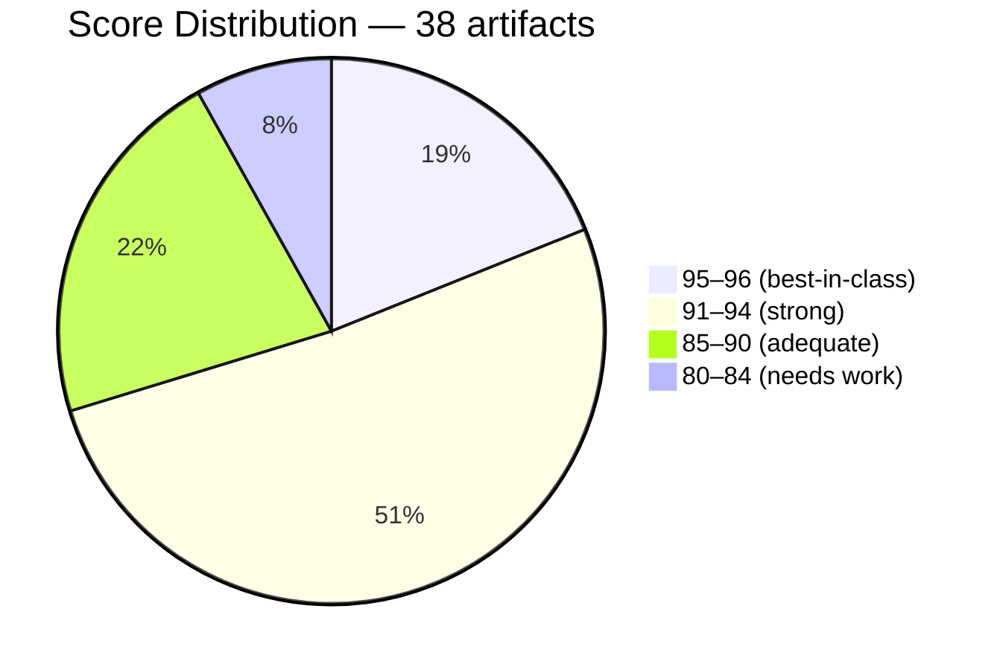
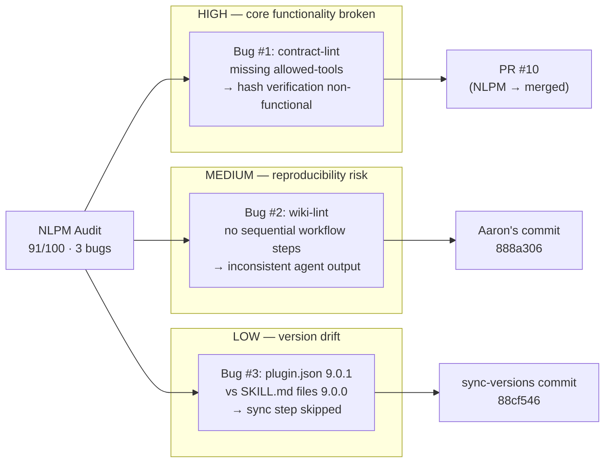
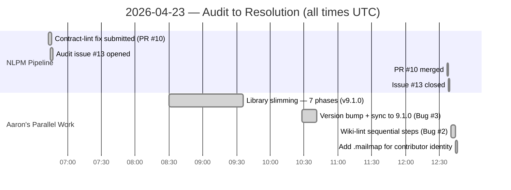

# When the Linter Can't Run Its Own Rules: Automated Bug Detection in a 1,200-Star SEO Skills Library

> **Disclosure**: This article was generated by an automated pipeline using Claude (Sonnet 4.6) based on audit data and GitHub records. It describes work performed by NLPM tooling maintained by [xiaolai](https://github.com/xiaolai). Readers should weigh claims accordingly.

## The Project

[seo-geo-claude-skills](https://github.com/aaron-he-zhu/seo-geo-claude-skills) is a plugin by [Aaron Zhu](https://github.com/aaron-he-zhu) that bundles 20 SEO and GEO skills for Claude Code, Cursor, Codex, and 35+ AI agents. The library covers keyword research, content writing, technical audits, rank tracking, and AI-citation optimization via the CORE-EEAT and CITE frameworks. At the time of audit, the repository had 1,205 stars and 171 forks — a clear signal of adoption among practitioners building AI-assisted SEO workflows.

Version 9.1.0 represents a mature system: a unified skill contract, multilingual triggers across seven languages, an auditor-class quality tier for two skills with SHA-integrity markers, and a wiki knowledge layer for session-persistent memory. The plugin's hooks are all prompt-type with no shell execution, and its single shell script performs only read-only validation. This is not a weekend project.

## The Audit

The NLPM automated audit ran on April 20, 2026, scoring 38 artifacts across commands, skills, and infrastructure. The audit was automated and unsolicited; no advance notice was given to the maintainer before the fork-and-PR process was initiated. The three-day gap between the audit (April 20) and the PR submission (April 23) reflects normal batch processing queue time in the contribute pipeline.

**Overall NL Score: 91/100**

| Layer | Count | Average Score |
|-------|-------|---------------|
| Commands | 15 | 88.0 |
| Skills | 20 | 93.6 |
| Infrastructure | 3 | 88.3 |

The skill layer is consistently excellent. All 20 SKILL.md files carry full frontmatter, numbered workflows, handoff summaries, multilingual triggers, and CORE-EEAT/CITE integration. The two auditor-class skills (`content-quality-auditor`, `domain-authority-auditor`) reach 95/100 with inline runbook sync, SHA integrity markers, and a 7-item artifact gate — the clearest example of best practice in the library. `commands/validate-library.md` alone scores 96/100.

The command layer pulls the average down. Nine of fifteen commands omit `allowed-tools` entirely. Three commands scored below 85. The most critical finding: `commands/contract-lint.md` scored 80/100 and was functionally broken — the library's self-verifier couldn't verify itself.

**Security posture**: CLEAR. Two LOW findings only — fourteen HTTP MCP endpoints (no stored credentials, all established SaaS providers) and a path-construction pattern in the validation shell script that poses no practical risk because the script is read-only with no network access or `eval`.

## What Was Submitted

The audit pipeline's PR tracking data shows no recorded submissions (`prs.json` is empty), most likely because PR #10 was submitted and merged on the same day before tracking completed. Commit evidence confirms the pipeline opened and merged one pull request:

**PR #10 — `fix/nlpm-contract-lint-allowed-tools`**
URL: https://github.com/aaron-he-zhu/seo-geo-claude-skills/pull/10

The fix added `allowed-tools: ["Read", "Grep", "Bash"]` to `commands/contract-lint.md`, enabling the hash-verification and pattern-scanning steps the command had specified but could not execute. Commit: [`2e93deb`](https://github.com/aaron-he-zhu/seo-geo-claude-skills/commit/2e93deb45381b0673ec16bf7e9f094a3aed711bd). Merged: [`08ef428`](https://github.com/aaron-he-zhu/seo-geo-claude-skills/commit/08ef428f58a1f3df414670f03d1a967edfe1891a).

Alongside PR #10, the pipeline created audit issue [#13](https://github.com/aaron-he-zhu/seo-geo-claude-skills/issues/13): *"NLPM automated audit: 3 bugs found (NL score 91/100)"*, documenting all three bugs and twenty-one quality findings. The contribute workflow submitted the fix in parallel with issue creation, so both actions completed within a 2-minute window — the Gantt shows PR #10 at 06:43 and issue #13 at 06:45.

The audit did not submit fixes for Bug #2 (wiki-lint missing sequential steps) or Bug #3 (plugin version drift), leaving those for the maintainer.

## The Response

No PR review comment files were available in the audit evidence, so the maintainer's response is reconstructed from commit history alone — reading a conversation from its commits is a bit like piecing together what was said from what got done.

Aaron independently resolved two of the three bugs. Bug #3 (version drift) had already been resolved earlier in the day via a `/seo:sync-versions` run that aligned all SKILL.md files to `9.1.0` ([`88cf546`](https://github.com/aaron-he-zhu/seo-geo-claude-skills/commit/88cf546182e5c1a26738e7c8f91834511e6aeb54)). PR #10 was merged at 12:37 UTC on April 23, 2026 — roughly six hours after the audit issue was opened. Within three minutes of the merge, Aaron committed his own fix for Bug #2 ([`888a306`](https://github.com/aaron-he-zhu/seo-geo-claude-skills/commit/888a306fe29f90eb36868afee803a33482e39ebe)), adding a ten-step numbered workflow to `wiki-lint.md`. The commit message notes the fix was "inspired by #11 (xiaolai/NLPM audit)" and reimplemented in the library's current compact style. (Note: the commit cites issue #11, while the documented NLPM audit issue is #13; no additional context is available to resolve this discrepancy.)

The broader sequence of commits on the same day — a 7-phase library compression reducing the repo from 37,129 to 24,587 lines — suggests the audit intersected with a major active refactoring session rather than a quiet maintenance window. Commit history suggests Aaron adapted rather than simply accepted the automated PR: the wiki-lint fix was reimplemented in his current style, consistent with either a direct response to the audit or independent parallel work.

## What the Audit Revealed

### The self-defeating linter

Bug #1 is structurally ironic — like a spell-checker that ships with a typo in its own name. `commands/contract-lint.md` is the command responsible for verifying that the SHA integrity markers in `content-quality-auditor` and `domain-authority-auditor` are correct. `allowed-tools` is a Claude Code field that gates which tools a command can invoke in automated execution; without `Bash` and `Grep` listed, the command cannot call `shasum` or scan patterns without real-time user approval — approval unavailable in pipeline contexts. In automated execution the integrity check is non-functional; in interactive use it becomes unpredictably prompt-dependent. The audit report frames this as a specification-execution gap: the command specifies behavior it cannot perform because a required capability declaration is absent.

It is possible the command layer was designed for interactive use where approval prompts are acceptable; the omission would only be a functional defect in automated or scripted execution contexts.

The audit's cross-component notes also flag that `commands/validate-library.md` would have detected the version drift (Bug #3) if run before a patch release. The gate existed; the process wasn't followed. The key was on the hook.

### Command-skill quality gap

The 5.6-point gap between command layer (88.0) and skill layer (93.6) averages reflects a common pattern in plugin development: the content (skills) receives the bulk of authoring effort while the orchestration layer (commands) gets a lighter pass — like a restaurant where the kitchen is immaculate and the ordering system runs on institutional memory. Eight of the nine commands missing `allowed-tools` are dispatch-only or read-only commands where the omission is lower-risk, but the pattern indicates the field wasn't treated as mandatory during authoring.

### Vague quantifiers at scale

Eighteen of twenty skills contain "comprehensive", "appropriate", "thorough", "significant", or "relevant" without numeric backing. This is a widespread NL quality issue, not specific to this library. A thorough audit of any kind tends to find a lot of the word "thorough." The audit credits skills that mitigate the pattern — `keyword-research` has an explicit quality bar table, `seo-content-writer` has a banned-vocabulary list, `on-page-seo-auditor` has an 11-step workflow — and scores them higher (95/100) accordingly.

### Fairness note

The vague-quantifier findings are real but the library's overall approach to precision is high. The presence of explicit decision gates (SHIP/FIX/BLOCK verdicts in the auditor-class skills), numerical thresholds in the CORE-EEAT framework, and SHA integrity markers all demonstrate deliberate thinking about determinism. The 91/100 score reflects a library that's close to best practice in most dimensions and has a specific, fixable weakness in the command scaffolding. Ninety-one out of a hundred is a good grade; the missing nine are the interesting part.

## Timeline

All three bugs — one submitted by NLPM, two fixed independently by Aaron — were resolved within six hours of the audit issue being created. In open source, six hours is less a turnaround than a reflex.

## Limitations

**Tracking gap in PR data.** The `prs.json` evidence file is empty, indicating a pipeline tracking gap — a small irony: the automated pipeline that submitted the PR filed no record of having done so. PR details in this article are reconstructed from commit messages, which name the branch and PR number but don't include reviewer commentary. The absence of review comment files means the maintainer's specific feedback on the fix cannot be cited.

**Snapshot during active development.** The audit issue was opened and PR submitted on the same day as a major refactoring. The v9.1.0 library compression — a -34% line reduction across seven phases — was in progress by April 23. Some findings may describe transient state rather than stable issues.

**NL scoring is mechanical.** The 91/100 score reflects penalty-based assessment of structural NL properties (presence of fields, presence of vague words, correct tool declarations). It does not evaluate whether the SEO methodology is correct, whether the CORE-EEAT framework is well-specified, or whether the library produces good results in practice. A library could score 100/100 on NL quality and give poor SEO advice.

**One day of outcome data.** All observations are from a single audit-and-merge cycle. There is no longitudinal data on whether the fixes held, whether vague quantifiers were addressed in subsequent releases, or whether the `allowed-tools` pattern was applied to the remaining eight commands.

## Significance

A 91/100 NL score is a strong result for a 38-artifact plugin. The finding that matters most isn't the score; it's that Bug #1 represents a class of failure where a command specifies behavior it literally cannot perform in automated contexts. The `contract-lint` command was authored to verify SHA integrity, the specification was correct, but the missing `allowed-tools` field rendered execution non-functional in pipelines. No test could surface this without actually attempting to run the command.

The same-day merge and the maintainer's independent follow-up (a self-authored wiki-lint fix in the library's current style) may reflect efficient issue triage — though a same-day merge of a small, low-risk change could equally reflect an active development session rather than deliberate evaluation of the audit's credibility. The broader v9.1.0 slimming — which happened in parallel — is consistent with either the audit contributing to the decision or Aaron having already planned the refactor before the audit ran; no causal claim is made. It shows a maintainer actively investing in the library's quality, making the three bug fixes a small addition to a larger quality effort rather than an isolated patch.

The library's security posture is genuinely clean. In a domain (SEO/GEO) that intersects with scraping, external API calls, and AI-citation manipulation, the choice to keep all hooks as prompt-type instructions with no shell execution, and to declare credentials as runtime-only for all 14 MCP integrations, suggests awareness of threat modeling in a domain where credential handling could be a risk. That's a quiet kind of expertise: knowing not just what to build, but what to leave out.
