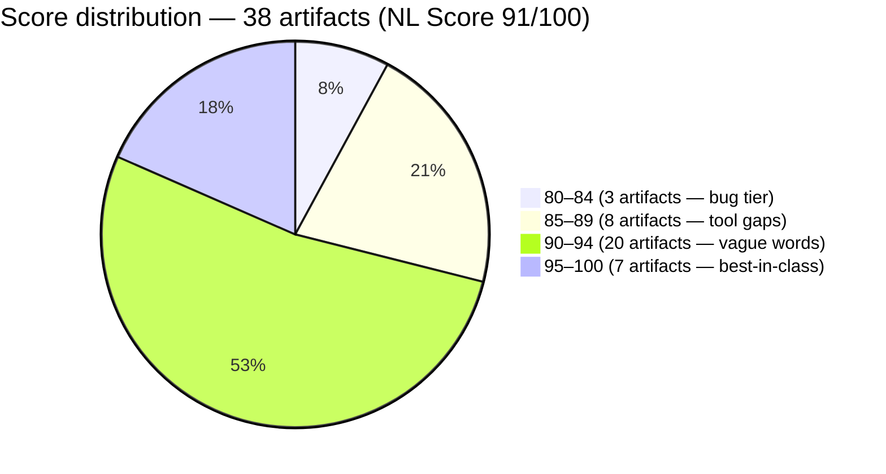
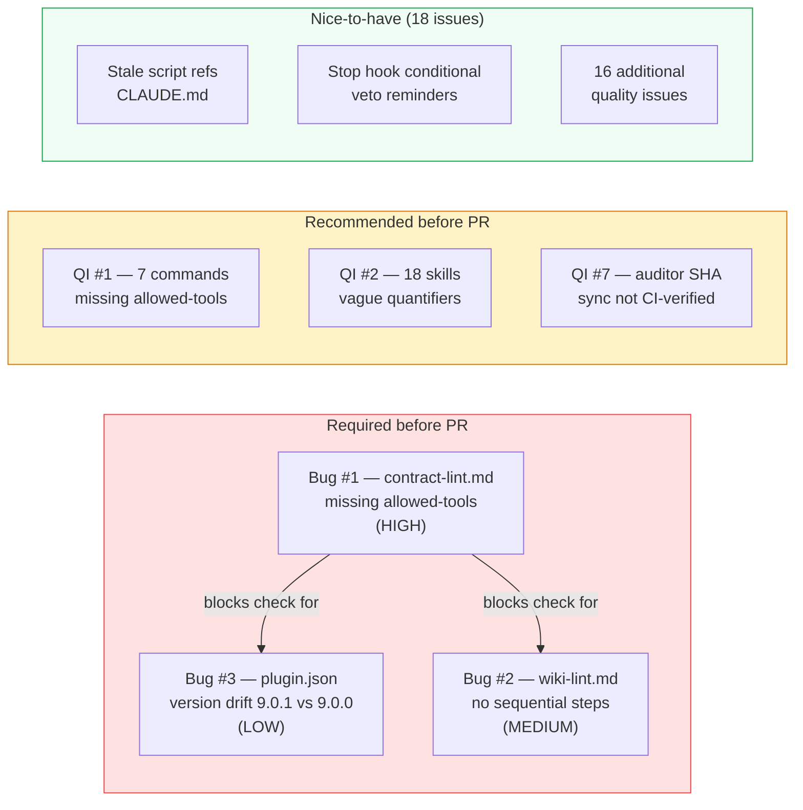
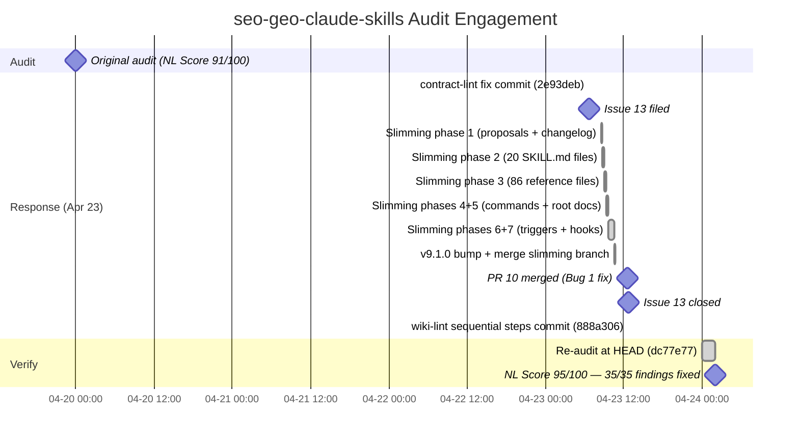

# Catalyst, Not Patchwork: How One Bug Report Launched a 12,500-Line Compression Pass

> **Disclosure**: This article was generated by an automated pipeline using Claude (Sonnet 4.6) based on audit data and GitHub records. It describes work performed by NLPM tooling maintained by [xiaolai](https://github.com/xiaolai). Readers should weigh claims accordingly.

---

## The Project

**seo-geo-claude-skills** is a library of 20 SEO and GEO skills for Claude Code, Cursor, Codex, and 35+ AI agents — covering keyword research, content writing, technical audits, and rank tracking, all organized around the CORE-EEAT + CITE quality frameworks. It is maintained by [Aaron Zhu](https://github.com/aaron-he-zhu) and at the time of audit held 1,227 stars and 174 forks. A library at that scale tends to accumulate surface area faster than any single reviewer can inspect it.

---

## The Audit

**Date**: 2026-04-20 | **Artifacts scored**: 38 | **NL Score**: 91/100 | **Security**: CLEAR

The library scored well above the 70-point threshold. The 20 skill files averaged 93.6/100 — consistently well-structured with full frontmatter, multilingual triggers across seven languages, numbered workflows, handoff summaries, and the CORE-EEAT / CITE quality frameworks wired throughout. The command layer was weaker, averaging 88.0/100, with several commands specifying operations they could not legally execute — designed for intent rather than execution, like blueprints filed before the permits arrived.

The audit found 3 bugs, 21 quality issues, and 2 low-severity security findings (no critical or high).

### Top Issues by Severity

The three bugs formed a chain. Bug #1 was the most consequential: `commands/contract-lint.md` declared SHA-256 hash verification and pattern scanning in its workflow but omitted `allowed-tools: ["Read", "Grep", "Bash"]` entirely. Without those tool declarations, the command's core integrity-checking function could not execute — the library's primary integrity gate, locked from the inside. Bug #2 (`wiki-lint.md`) had a 7-check validation table with no numbered sequential steps — the command listed what to check but not how or in what order. Seven criteria without a sequence is seven things to worry about simultaneously. Bug #3 was a version-drift mismatch: the plugin manifest declared `9.0.1` while all 20 SKILL.md files declared `9.0.0`.

Bug #1 disabled the library's primary integrity gate — the SHA-verification contract between `contract-lint.md` and the auditor-class runbook blocks. Bug #3's version drift was separately detectable via `/seo:validate-library` check #6, a gate whose output was also not verified. Version drift of this kind is also typical of a two-step release process; whether it represents a missed sync step or an in-progress release is not determinable from the evidence alone.

The security scan found two low-severity items: 14 HTTP MCP server endpoints (no stored credentials; auth at connection time) and a path-construction pattern in `scripts/validate-skill.sh` that posed no practical risk since the script is read-only.

---

## What Was Submitted

Tracking data shows an issue and a merged PR from NLPM; the full PR record was not captured in the pipeline's PR ledger.

**Issue [#13](https://github.com/aaron-he-zhu/seo-geo-claude-skills/issues/13)** — *"NLPM automated audit: 3 bugs found (NL score 91/100)"* — was filed on 2026-04-23T06:45:30Z and closed the same day at 12:38:48Z.

Commit `2e93deb` landed two minutes before the issue was filed with the message: *"fix(contract-lint): add allowed-tools to enable hash verification — The command specifies SHA-256 hash verification … but declared no allowed-tools, making its core integrity-check functionality non-functional."* This commit was subsequently merged as **PR #10** (`xiaolai/fix/nlpm-contract-lint-allowed-tools`) at 12:37:21Z, one minute before the issue closed.

The merge commit URL is: [08ef428](https://github.com/aaron-he-zhu/seo-geo-claude-skills/commit/08ef428f58a1f3df414670f03d1a967edfe1891a)

The pipeline submitted the fix commit before formally filing the issue — the issue served as the public tracking artifact for an already-submitted change. The PR addressed one finding (Bug #1); the remaining 34 were resolved by the maintainer's independent v9.1.0 pass.

---

## The Response

The maintainer's response went well beyond Bug #1 — a phrase the following timeline makes embarrassingly literal.

The first slimming commit arrived 1h45m after the issue was filed. Within six hours, Aaron Zhu had completed a 7-phase library-wide compression: **v9.1.0** — 37,129 → 24,587 lines (-34% across all content). The commit log describes each phase methodically:

| Phase | Scope | Lines removed (approx.) |
|-------|-------|--------------|
| 1 | Delete obsolete proposals + truncate changelog | ~600 |
| 2 | Compact all 20 SKILL.md files (-20%) | 1,349 |
| 3 | Compress 86 reference files (GENERIC/TEMPLATE/PROCESS) | ~8,517 |
| 4 | Compress 15 command files (-31%) | 514 |
| 5 | Restructure root docs, drop 4 multilingual READMEs | 1,151 |
| 6+7 | Trim triggers + compress hooks.json (-41%) | ~167 |

A 16-agent review cleared the compression (per commit `d9bf8c7` message): no broken links, all validators passing, 88% trigger retention, 6 languages preserved. This was not a patch; it was a release.

Separately, commit [888a306](https://github.com/aaron-he-zhu/seo-geo-claude-skills/commit/888a306fe29f90eb36868afee803a33482e39ebe) addressed Bug #2 directly: *"fix(wiki-lint): add sequential workflow steps … Inspired by #11 (xiaolai/NLPM audit), reimplemented in compact format to match post-slimming style."* The maintainer implemented the fix their own way to match the newly compressed style — a sign of ownership, not just compliance. The fix arrived dressed for the new neighborhood. (Note: the commit references issue #11; the NLPM issue filed was #13. Whether #11 refers to a prior engagement or is a commit-message typo is not determinable from available evidence.)

The NLPM pipeline did not generate review comments that would appear in a PR reviews file; the maintainer's acknowledgment of the audit came through commit messages and the speed of action.

---

## The Re-Audit

A re-audit score is a claim. The re-audit verifies that claim against the target repo's current HEAD.

**Before**: `unknown` ref, score 91/100 | **After**: [`dc77e77`](https://github.com/aaron-he-zhu/seo-geo-claude-skills/commit/dc77e77962d2dca3706273c6f47c20195bd475a9), score 95/100 | **Date**: 2026-04-24

### Per-Finding Outcome Table

All 35 original findings carry the same outcome — read in sequence, the phrase repeats like a roll call of problems that no longer exist:

| # | File | Rule | Pattern | Outcome | PR |
|---|------|------|---------|---------|-----|
| 1 | `commands/contract-lint.md` | BUG-undeclared-tool | `missing-allowed-tools` | fixed — upstream, not via our PR | |
| 2 | `commands/wiki-lint.md` | BUG-missing-steps | `missing-step-ordering` | fixed — upstream, not via our PR | |
| 3 | `.claude-plugin/plugin.json` | CC-version-drift | `version-drift` | fixed — upstream, not via our PR | |
| 4 | `commands/audit-domain.md` | BUG-undeclared-tool | `missing-allowed-tools` | fixed — upstream, not via our PR | |
| 5 | `commands/keyword-research.md` | BUG-undeclared-tool | `missing-allowed-tools` | fixed — upstream, not via our PR | |
| 6 | `commands/optimize-meta.md` | BUG-undeclared-tool | `missing-allowed-tools` | fixed — upstream, not via our PR | |
| 7 | `commands/p2-review.md` | BUG-undeclared-tool | `missing-allowed-tools` | fixed — upstream, not via our PR | |
| 8 | `commands/report.md` | BUG-undeclared-tool | `missing-allowed-tools` | fixed — upstream, not via our PR | |
| 9 | `commands/setup-alert.md` | BUG-undeclared-tool | `missing-allowed-tools` | fixed — upstream, not via our PR | |
| 10 | `commands/write-content.md` | BUG-undeclared-tool | `missing-allowed-tools` | fixed — upstream, not via our PR | |
| 11 | `SKILL.md` | R01 | `vague-quantifiers` | fixed — upstream, not via our PR | |
| 12 | `commands/audit-domain.md` | UNCLASSIFIED | `missing-argument-hint-field` | fixed — upstream, not via our PR | |
| 13 | `commands/optimize-meta.md` | UNCLASSIFIED | `missing-argument-hint-field` | fixed — upstream, not via our PR | |
| 14 | `commands/wiki-lint.md` | UNCLASSIFIED | `missing-argument-hint-field` | fixed — upstream, not via our PR | |
| 15 | `commands/p2-review.md` | UNCLASSIFIED | `missing-argument-hint-field` | fixed — upstream, not via our PR | |
| 16 | `hooks/hooks.json` | UNCLASSIFIED | `stop-hook-auto-appends-critical-veto-ite` | fixed — upstream, not via our PR | |
| 17 | `commands/geo-drift-check.md` | UNCLASSIFIED | `experimental-v9-0-label-in-claude-md-but` | fixed — upstream, not via our PR | |
| 18 | `CLAUDE.md` | BUG-broken-reference | `broken-reference` | fixed — upstream, not via our PR | |
| 19 | `cross-cutting/content-quality-auditor/SKILL.md` | UNCLASSIFIED | `both-auditor-class-skills-carry-the-iden` | fixed — upstream, not via our PR | |
| 20 | `cross-cutting/domain-authority-auditor/SKILL.md` | UNCLASSIFIED | `both-auditor-class-skills-carry-the-iden` | fixed — upstream, not via our PR | |
| 21 | `SKILL.md` | UNCLASSIFIED | `metadata-geo-relevance-values-are-hardco` | fixed — upstream, not via our PR | |
| 22 | `research/competitor-analysis/SKILL.md` | UNCLASSIFIED | `include-a-scraping-legality-note-verify` | fixed — upstream, not via our PR | |
| 23 | `optimize/internal-linking-optimizer/SKILL.md` | UNCLASSIFIED | `include-a-scraping-legality-note-verify` | fixed — upstream, not via our PR | |
| 24 | `hooks/hooks.json` | UNCLASSIFIED | `the-filechanged-hook-matcher-hot-cache-m` | fixed — upstream, not via our PR | |
| 25 | `commands/report.md` | UNCLASSIFIED | `cross-project-mode-is-described-but-the` | fixed — upstream, not via our PR | |
| 26 | `build/seo-content-writer/SKILL.md` | UNCLASSIFIED | `banned-vocabulary-list-crucial-robust-le` | fixed — upstream, not via our PR | |
| 27 | `monitor/performance-reporter/SKILL.md` | UNCLASSIFIED | `11-step-workflow-integrates-core-eeat-an` | fixed — upstream, not via our PR | |
| 28 | `cross-cutting/memory-management/SKILL.md` | UNCLASSIFIED | `gdpr-art-17-deletion-flow-is-documented` | fixed — upstream, not via our PR | |
| 29 | `All research skills` | UNCLASSIFIED | `the-next-best-skill-section-uses-markdow` | fixed — upstream, not via our PR | |
| 30 | `commands/p2-review.md` | UNCLASSIFIED | `tombstone-rule-states-tombstone-review-2` | fixed — upstream, not via our PR | |
| 31 | `commands/sync-versions.md` | UNCLASSIFIED | `step-5-says-to-verify-all-3-cross-agent` | fixed — upstream, not via our PR | |
| 32 | `optimize/technical-seo-checker/SKILL.md` | UNCLASSIFIED | `llm-crawler-handling-section-names-speci` | fixed — upstream, not via our PR | |
| 33 | `build/schema-markup-generator/SKILL.md` | UNCLASSIFIED | `ftc-disclosure-note-for-aggregaterating` | fixed — upstream, not via our PR | |
| 34 | `SKILL.md` | UNCLASSIFIED | `save-results-section-is-identical-across` | fixed — upstream, not via our PR | |
| 35 | `hooks/hooks.json` | UNCLASSIFIED | `userpromptsubmit-hook-line-36-fires-on-e` | fixed — upstream, not via our PR | |

The "upstream, not via our PR" outcome reflects NLPM's tracking logic: a fix is attributed to a PR only when the contribution workflow directly submitted and tracked it. Here, the maintainer's own v9.1.0 compression resolved the vast majority of findings independently. Bug #1 was addressed via PR #10, which the pipeline submitted but whose merge NLPM's contribution tracker did not capture as a matched fix event. The outcome label is accurate within its definition; it is not an indictment of the PR.

### Introduced Findings

The re-audit found 28 findings not present in the original audit. These may be true regressions introduced by the v9.1.0 compression (which removed content from command bodies, potentially stripping implicit error-handling guidance), or artifacts of scoring drift where the re-audit model applies R15 (missing empty-input handling) and R17 (missing error paths) more strictly than the original audit model did. Both possibilities are plausible; the evidence does not distinguish between them. When a library sheds 12,500 lines, what looked implicit sometimes emerges plainly absent.

The pattern is consistent: 11 of the 15 commands are now missing explicit empty-input handlers and error-path descriptions — a gap that the compression likely exposed rather than created, as shorter commands have less room for implicit context. One genuine regression is plausible: the `FileChanged` hook event (R27), which was not flagged in the original audit but is invalid per NLPM conventions §7. Whether the original audit missed it or a post-audit commit introduced it is not determinable from the evidence. If the original audit had applied R15/R17 penalties with the same strictness as the re-audit, the original score would likely have been lower than 91 — making the 4-point gain a conservative estimate.

**35 of 35 original findings verified fixed; 0 still persist.**

The house passed inspection; the renovation found new work. As of this writing, no follow-up issue has been filed for the 28 introduced findings. If NLPM initiates a second engagement, the pipeline will reference this case study as prior context.

---

## What the Audit Revealed

Three structural patterns were visible across the library's command layer.

**Capability without declaration.** Nine of fifteen commands specified operations that required tools (`Bash`, `Grep`, `Read`) but omitted the `allowed-tools` frontmatter field (QI #1 covers 7; Bugs #1 and #2 each add one more, totaling nine). The most consequential case — `contract-lint.md` — made this gap self-defeating: the command that was supposed to verify the library's integrity could not run the operations it was specified to perform. The remaining eight may be dispatch-only commands that delegate execution to skills; for those, the missing declaration is a convention gap rather than a functional failure. The fix is mechanical; the pattern reveals that command authors were designing for intent rather than execution.

**Vague quantifiers across the skill layer.** Eighteen of twenty skills contained quantifiers like "comprehensive," "appropriate," "thorough," and "relevant" without measurable definitions. The library partially mitigated this in its two highest-scoring commands: `keyword-research/SKILL.md` scored 95 because it paired "appropriate" with an explicit quality bar table; `seo-content-writer/SKILL.md` scored 95 because it had a banned-vocabulary list that flagged many of the same words for output review. The skills that lacked those mitigations scored 92–93. NLPM's R01 rule flags vague quantifiers without reference to domain frameworks; in a library where "comprehensive" is operationalized by the CORE-EEAT rubric, some findings may be less severe than the score penalty implies.

**A fairness note**: a 91/100 score with a CLEAR security rating and 7 artifacts at 95–96 means this library was, even before fixes, in the top tier of Claude Code plugin libraries NLPM has audited. The bugs were real; they were also addressable in hours. The library's own `/seo:validate-library` command would have surfaced the version drift and tool-declaration gaps if run before release — NLPM provided an independent external pass, not a capability the library lacked — a confirmation that the library was already operating near the top of its range, not a rescue.

---

## Timeline

---

## Limitations

**The "upstream, not via our PR" outcome does not mean the PR had no effect.** The NLPM contribution tracker attributes fixes to tracked PRs; Bug #1 was submitted as PR #10 and merged, but the merge was not recorded in the pipeline's ledger. The outcome label reflects a tracking gap, not a counterfactual about influence.

**The introduced findings cannot be attributed to cause.** 28 new R15/R17 patterns appear in the re-audit. Whether the v9.1.0 compression introduced them by shortening command bodies, or the re-audit model applies those rules more aggressively than the original model, is not determinable from the available data. Both are plausible; neither is established.

**The re-audit measures file-level quality at one point in time; it does not verify that maintainer intent aligns with our rule set.** The maintainer implemented the wiki-lint fix in "compact format to match post-slimming style" — their words, their design choice. NLPM's rules are one lens; the maintainer has their own quality model. The 95/100 score reflects what NLPM can measure, not what the library is designed to optimize for.

**The score improvement cannot be isolated to the audit.** The v9.1.0 slimming was a planned compression pass; commit [d9bf8c7](https://github.com/aaron-he-zhu/seo-geo-claude-skills/commit/d9bf8c7c09383a60ef3933f929cbf2d9a7fe05e2) describes a 16-agent review that preceded the merge. The audit may have accelerated it or sharpened its scope; it was not the sole cause.

**prs.json is empty.** The pipeline's PR ledger did not capture any PRs for this repo. PR #10 is documented only through commit messages. This is a tracking gap in the pipeline, not evidence that no PR was filed.

---

## Significance

The engagement produced a 4-point score increase (91→95) and closed 35 findings — all within 24 hours of the issue being filed. The compression also surfaced 28 patterns not present in the original audit; the net finding delta is −7, not −35. A 4-point gain is above-average for a post-fix re-audit on a library that started above 90.

What makes this engagement unusual is the ratio between the contribution NLPM made (one Bug #1 fix, one issue report) and the response it received (a 7-phase, 12,542-line compression addressing 35 findings across the entire library). This is not a case of a maintainer accepting a patch. It is a case of an audit becoming a catalyst: the bug report gave the maintainer a documented external view of the library's weakest layer, and they used it as the occasion for a systematic overhaul they may have been planning.

The re-audit confirms that the overhaul worked at the file level. All 35 original findings are gone. The 28 newly surfaced patterns — consistently missing error-handling structure in the command layer — represent the next quality frontier for the library, and they are the kind of patterns that a second engagement could target methodically.

The broader point: at 1,227 stars and 174 forks, `seo-geo-claude-skills` is one of the larger SEO tooling repositories among the Claude Code plugin repositories NLPM has audited. A library at this scale responds to external audit differently than a smaller one. When the maintainer has the capacity for a 16-agent review and a 7-phase compression pass, an audit report functions less as a fix instruction and more as a prioritized signal. The NLPM tooling found the signal. The maintainer didn't just act on it — they used it as the starting line for a sprint that had apparently been queuing up. In open source, that is not a small thing: a bug report becoming a release note.
