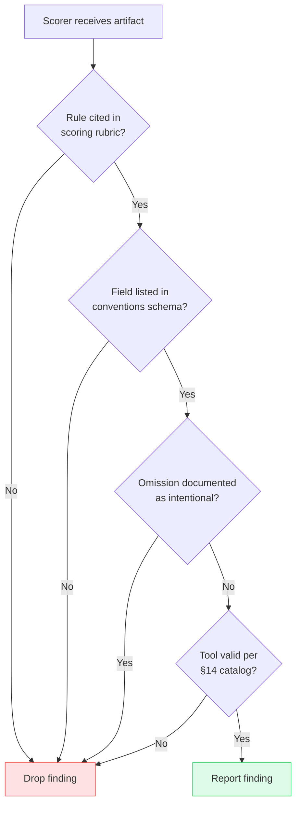
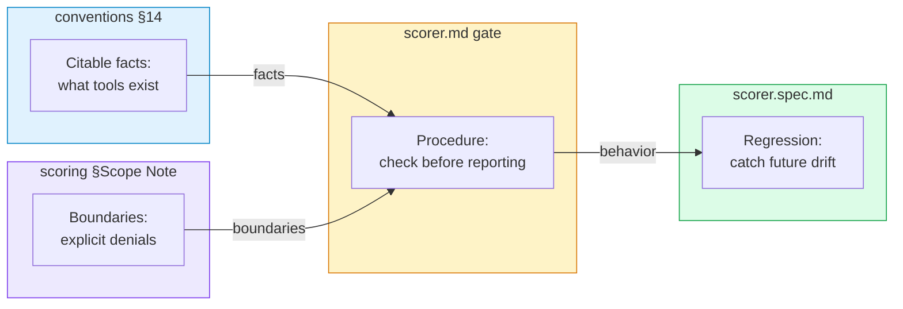

# The Mirror Test: When the Scorer Started Inventing Rules

> **Disclosure**: This case study was written by Claude (Opus 4.7) at the request of NLPM's maintainer [xiaolai](https://github.com/xiaolai). The subject of the audit — the NLPM scorer agent — is itself powered by Claude (Sonnet 4.6 at time of writing). The author, the tool, and the auditee are all instances of the same model family. Readers should weigh that accordingly.

---

## The Context

Over the past three weeks, NLPM's audit pipeline visited seven external Claude Code plugin repositories. It scored `wshobson/agents`, `sickn33/antigravity-awesome-skills`, `hesreallyhim/awesome-claude-code`, `jeremylongshore/claude-code-plugins-plus-skills`, `nyldn/claude-octopus`, and filed bug-fix PRs where maintainers accepted them. Each engagement generated findings, each finding carried a rule number, each rule number pointed to a line in `skills/nlpm/scoring/SKILL.md` — a 100-point penalty rubric that starts at 100 and subtracts for documented defects.

The rubric is the judge. Seven external repos got judged.

Today, on 2026-04-24, we pointed the rubric inward. `/nlpm:score` ran across all 18 plugins in the xiaolai marketplace, including NLPM itself. This is the plugin that audits other plugins, now auditing itself — a judge reading its own judgment.

The judge began making things up.

---

## The Run

**Date**: 2026-04-24 | **Plugins audited**: 18 | **Aggregate score**: 82.5/100

All 18 plugins scored in the 70–98 range. On the surface, a clean result: nothing below the 70 threshold, no security red flags, mostly actionable findings. But while reading the per-plugin reports, the maintainer noticed a pattern across seven of them.

**The scorer was reporting findings that could not be traced to any documented penalty.**

Not a handful of edge cases. Seven plugins, five distinct categories, each category reported across multiple files with confident rule-number assertions. At first glance, well-formed findings. On second reading, phantom ones.

---

## What We Found

Each row below documents a finding type the scorer reported. For each, the "why it is invalid" column cites the specific line of specific documentation that rules it out.

| # | Hallucinated finding | Actual convention | Plugins affected |
|---|---|---|---|
| FP1 | "Skill missing `namespace:` field" | `conventions` §5 lists only `name`, `description`, `version`, `globs` — no `namespace` | tdd-guardian (7 skills flagged) |
| FP2 | "plugin.json missing `hooks`/`skills` registration blocks" (expecting inline arrays) | `conventions` §1 defines these as optional **path strings**, never inline registration | claude-english-buddy, docs-guardian, tdd-guardian |
| FP3 | "`AskUserQuestion` is an undocumented tool" | Real Claude Code built-in — not catalogued anywhere in `conventions` | nlpm, echo-sleuth |
| FP4 | "Agent missing `skills:` when body references skill knowledge" | Intentional omission — vague-scanner documented as having no skills per `CLAUDE.md:28` | nlpm (vague-scanner) |
| FP5 | "plugin.json missing `engines` / `minClaudeVersion` / `main`" | No such fields exist in the schema — not listed as required or optional anywhere | three unpublished in-development plugins |

The pattern is specific enough to name. Four of the five involve missing fields — fields the rubric has no claim about. One (FP3) involves a real tool the scorer failed to recognize. All five have the same shape: the scorer applied a schema the scorer imagined.

### Reading the Evidence

**FP1 — `namespace:` on skills.** The skill frontmatter fields documented in `conventions` §5 are `name`, `description`, `version`, `globs`. No `namespace`. The scoring rubric's Skills table cites the same four. There is no penalty row anywhere for `namespace`. Yet seven tdd-guardian skills were flagged for its absence.

**FP2 — inline `hooks`/`skills` blocks in plugin.json.** `conventions` §1 is explicit: `hooks` and `skills` are "Component path fields (all optional, string or string[])." They are pointers to files, not inline configuration. The scorer's finding assumed a schema where plugin.json contains inline registration arrays — a schema no Claude Code plugin has ever had.

**FP3 — `AskUserQuestion` undocumented.** The tool exists. It is a native Claude Code built-in. It is available in the session where this article was written. `conventions` did not have a tool catalog before today, so the scorer had no citable authority to check against. Instead of reporting "no catalog exists," it reported "tool is undocumented" — a finding that sounds rule-based but is not.

**FP4 — agent missing `skills:`.** The vague-scanner agent is documented in the plugin's own CLAUDE.md with the explicit annotation `(no skills)`. It is a mechanical word-counter; it has no judgment to delegate. The scorer penalized it for the absence.

**FP5 — `engines` / `minClaudeVersion` / `main` in plugin.json.** These are foreign conventions. `engines` and `main` come from Node.js `package.json`; `minClaudeVersion` is not documented in any system this rubric describes. None appear in `conventions` §1 or anywhere in the rubric. The scorer synthesized a composite schema and applied it.

---

## The Mechanism

Why would a rule-based scorer, asked to apply a fixed rubric, invent rules?

The rubric is markdown text passed into a Claude model. Claude is not a rule engine; it is a model that has absorbed many rubrics across many domains and makes inferences about which apply. When asked to score a `plugin.json`, it does not execute `conventions` §1 as a deterministic parser would. It reads `conventions` §1, decides the text describes the same thing as thousands of `package.json` files it has seen, and offers suggestions consistent with the combined schema.

In most calls, this is a feature. A model that notices a missing `author` field in `plugin.json` because "most JSON manifests include one" is useful — even when the rubric is silent, the inference may still be right.

In rare calls, it is a defect. A model that reports "plugin.json missing `engines:` field" because "most npm-style manifests have one" is applying a schema the rubric does not describe and the system does not require.

The inference path is the same. Whether a given suggestion lands on the useful side or the defective side depends on how closely the rubric's schema matches the model's absorbed priors. When they match, judgment fills in gaps the rubric left. When they diverge, judgment fills in gaps the rubric wanted left open.

### A Plausible Trigger

The NLPM scorer runs on the `claude-code-action` default model — currently Sonnet 4.6, previously Sonnet 4.5, before that earlier Sonnet revisions. Model upgrades arrive silently; the scorer pipeline picks them up without version-pinning. Each upgrade shifts the model's absorbed priors without the rubric shifting in response.

This is a hypothesis, not a measurement — NLPM's audit logs do not go back far enough to prove when FP1–FP5 first appeared. But the shape of the observation is consistent with model drift. A more inventive model produces more inventive findings. Without a rubric that explicitly denies the inventions, the inventions get reported.

**The meta-pattern**: as the evaluator gets smarter, the rulebook must get more defensive. A rulebook is not a complete specification of what the rules are; it is an incomplete statement whose gaps the model fills in. Smarter models fill in more gaps, more creatively — for better and worse.

---

## The Fix

Three documentation layers and one test layer were added. Each addresses a different gap the model fills in unsupervised.



### Layer 1: Citable Facts

`skills/nlpm/conventions/SKILL.md` gains §14, a tool catalog. Every Claude Code built-in tool is named: `Read`, `Write`, `Edit`, `MultiEdit`, `NotebookEdit`, `Glob`, `Grep`, `Bash`, `BashOutput`, `KillBash`, `Task`, `WebFetch`, `WebSearch`, `AskUserQuestion`, `TodoWrite`, `SlashCommand`. MCP tools follow a named pattern. Case-sensitivity is stated.

The scorer now has a document to cite when asked "is this tool valid?"

### Layer 2: Behavioral Gate

`agents/scorer.md` gains a "Do Not Invent Findings" section. Four checks apply before any finding is reported: rubric check, schema check, intent check, tool catalog check. If a finding fails any of them, it is dropped.

The section also enumerates the exact fields that must not be flagged as missing: `namespace:` on skills, `main:` / `engines:` / `minClaudeVersion:` on `plugin.json`, inline `hooks:` / `skills:` blocks, `tools:` on reference-only skills, `commentary:` on agent examples. Five mistakes named. No new rules added. The rubric stays the rubric; the agent stops filling in its gaps.

### Layer 3: Explicit Denials in the Rubric

`skills/nlpm/scoring/SKILL.md` gains a "Known False Positive Patterns" table in its Scope Note. The six patterns that have been observed or are plausibly next are listed, with the reason each is invalid. The final row addresses a pattern we did not apply but could foresee: "plugin.json description shorter than sibling marketplace.json description" — desynchronization, not defect.

The rubric now states what it does not rule on, in addition to what it does.

### Layer 4: Regression Tests

`.nlpm-test/scorer.spec.md` gains five new scenarios, one per observed false positive. Each follows the Given/When/Then form: given the specific structure that was hallucinated against, when scored, then no finding is emitted for the hallucinated category.

If a future model reintroduces any of the five, `/nlpm:test` will catch it.

### The Four-Layer Logic

The four layers attack different gaps:



No single layer is sufficient. The tool catalog without the behavioral gate produces a scorer that reads it but does not check it. The behavioral gate without the rubric boundary produces a scorer that rejects findings but cannot explain why. The rubric boundary without the regression suite produces a fix that regresses silently on the next model upgrade. Stacking all four leaves no obvious hole.

---

## The Re-Audit

A rubric update is a claim, not a verification. Hours after the v0.7.6 commit, the scorer was pointed back at the six published plugins in the xiaolai marketplace — including NLPM itself — to see whether the four-layer defense held on real targets.

Six parallel scoring runs. Each loaded the v0.7.6 rubric from disk and audited one plugin. For each run, the five FP patterns were named explicitly as regression checks: "did this category reappear? yes/no."

| Plugin | Score | Artifacts | FP1 | FP2 | FP3 | FP4 | FP5 |
|---|---:|---:|---|---|---|---|---|
| nlpm (self) | 96 | 32 | clean | clean | clean | clean | clean |
| claude-english-buddy | 99 | 10 | clean | clean | clean | clean | clean |
| grill | 96 | 10 | clean | clean | clean | clean | clean |
| docs-guardian | 99 | 26 | clean | clean | clean | clean | clean |
| tdd-guardian | 95 | 19 | clean | clean | clean | clean | clean |
| echo-sleuth | 98 | 19 | clean | clean | clean | clean | clean |

Thirty regression checks — five FPs across six plugins — all clean. The exact cases that would have triggered FPs under v0.7.5 passed silently: tdd-guardian's seven skills without `namespace:`, `AskUserQuestion` declared in three plugins' `allowed-tools`, vague-scanner omitting `skills:` by design. The gate held where it mattered.

But the re-audit surfaced two calibration items the first pass had not anticipated. A working rubric is one that keeps surfacing its own edges.

### R01 Penalizes Its Own Definition

Four artifacts in NLPM hit R01's −20 vague-quantifier cap — not because they contain vague language, but because they *enumerate the vocabulary R01 flags*. The scorer has to list the eleven words in order to check for them. The rubric row defining R01 has to list them to define itself. Documentation that teaches R01 lists them by way of explaining.

R01 is mechanical by design — "each occurrence of 'appropriate', 'relevant', 'as needed'..." — and does not distinguish between a word *used* and a word *mentioned*. Backticks do not save you. Code fences do not save you. Quoting R01's vocabulary in a comma-separated sentence earns a full −20 cap hit.

This is the rubric operating as specified. It is also a category error: a rubric that penalizes its own definition for quoting itself is measuring its own reflection. The fix is a mention-vs-use distinction — exempt occurrences inside inline code spans, fenced code blocks, and literal enumerations of the vocabulary.

### The `Agent` / `Task` Alias Gap

`commands/security-scan.md` declares `Agent` in its `allowed-tools`. The §14 tool catalog added in v0.7.6 lists the agent-dispatch tool as `Task`. The rest of the ecosystem — `grill`, `docs-guardian`, `tdd-guardian` — also uses `Task`. Either `Agent` is a deprecated alias or a local mistake; no rubric row today penalizes undocumented tools, so the four-step gate correctly drops the finding. But the artifact is inconsistent with its own plugin's catalog — a case the gate notices and cannot act on.

Two follow-ups surface: fix `security-scan.md` to match §14, and consider whether an "unknown-tool-in-allowed-tools" penalty row should exist. The second is deferrable — §14 is less than a day old, and may itself be incomplete.

### What the Re-Audit Confirmed

The model-drift hypothesis remains unproven (the audit logs are still empty). But the re-audit produced adjacent evidence: under v0.7.6, the scorer stops inventing the five categories it was inventing earlier today. The four-layer defense works against the specific patterns it was designed to block. New structural issues — like R01 self-reference — were surfaced by the audit process itself, not by human review. That is what a working rubric is supposed to do.

---

## The Mirror Test

Everything written here happened inside one conversation with Claude. The case study was written by Claude. The scorer is run by Claude. The rubric was written by a prior Claude session. The PRs to external repos were drafted by Claude. The plugin under audit was built by — or at least with — Claude.

At each stage, a human held the rudder. The maintainer flagged the seven plugins. The maintainer wrote the self-update proposal. The maintainer discarded unrelated working-tree changes before approving the update. The maintainer is reading this paragraph now, deciding whether it is accurate. No step in the chain ran without a human checkpoint.

But the question the engagement poses is structural. If the scorer and the rubric are both authored by the same family of models, who catches the drift when the models drift? Today, the answer was "a human running `/nlpm:score` on his own work and noticing the findings did not match the rubric." That works. It does not scale.

The new layers are a partial answer. They give the scorer a rubric it can citably verify against, and a regression suite that will fire when it cannot. They do not solve the underlying problem — that a model reading a rubric is not the same as a rule engine executing one, and a rulebook written to be readable is not the same as a rulebook written to be complete.

The mirror test is not a one-time check. It is the realization that as the evaluator evolves, the thing being evaluated needs to evolve to match — including when the thing being evaluated is the evaluator.

---

## Timeline

```mermaid
gantt
    title NLPM Self-Audit — 2026-04-24
    dateFormat HH:mm
    axisFormat %H:%M

    section Audit
    /nlpm:score across 18 plugins       :done, a1, 05:00, 70m
    Maintainer flags five FP patterns   :milestone, 06:20, 0m

    section Analysis
    Trace each FP to documentation      :done, 06:20, 30m
    Self-update proposal written        :done, 06:36, 1m

    section Fix
    Verify claims line-by-line          :done, 08:30, 20m
    Apply 4 updates + version bump      :done, 08:50, 20m
    Write case study                    :done, 09:10, 60m

    section Verify
    Re-audit 6 published plugins        :done, 10:30, 45m
    Record 30/30 FP regression passes   :milestone, 11:15, 0m
    Surface R01 self-ref + Agent/Task   :milestone, 11:20, 0m
    Update case study                   :done, 11:20, 30m
```

Approximate times; proposal timestamp from file mtime. Same-day from audit to applied fix to re-audit verification to published case study.

---

## Limitations

**The model-upgrade hypothesis is unverified.** NLPM's audit logs (`findings.jsonl`, `disagreements.jsonl`) are empty at the time of writing; there is no historical data showing when FP1–FP5 first appeared. The correlation with model upgrades is plausible but not established.

**The fix targets the five observed patterns.** Other hallucinated categories may exist that today's audit did not surface. The four-step behavioral gate catches the class (uncitable findings), but the explicit-denial table only lists what has been seen. The re-audit covered six published plugins and surfaced two new calibration items (R01 self-reference, Agent/Task alias) — future audits will likely surface more.

**The formal test suite was not executed.** `.nlpm-test/scorer.spec.md` describes expected behavior; `/nlpm:test` evaluates the scorer's output against the specs. The re-audit across the six published plugins validated FP1–FP5 regression behavior manually, but the specs themselves were not run under the official test harness. That remains a next step.

**The case study is self-authored.** Claude wrote the scorer, the fix, this article, and the re-audit sub-agents. The conflict of interest is structural, not resolvable from inside the same model family. External review of this engagement is available only as a future artifact.

**The PRs to external repos during the preceding three weeks used the v0.7.5 scorer.** Whether any of those PRs carried FP1–FP5 findings is a question for a separate audit of the outgoing PR record. The re-audit covered only internal plugins.

---

## Significance

The engagement produced four surgical edits (~109 lines) and a version bump from 0.7.5 to 0.7.6. No structural rewrites, no new commands, no new agents. The thing that changed is what the scorer is allowed to say.

Seven external engagements taught NLPM how to audit. The eighth — turning the audit inward — taught it what it had been getting wrong about itself. A scoring system that cannot evaluate its own output honestly is limited in what it can teach others. A scoring system that can is useful, within the limits of the rubric it stands on.

The broader pattern — rule systems paired with increasingly capable evaluators — is not unique to NLPM. Any automated-review pipeline that pairs a static rulebook with an evolving model runs the same risk. The fix is not to pin the model or freeze the rulebook; both are living artifacts. The fix is to write the rulebook so that the gaps it leaves are explicit gaps, not invitations to invent.

NLPM now names some of its own gaps. It will likely need to name more of them, on a schedule that tracks model upgrades rather than calendar quarters. The mirror test, as a discipline, is: run the scorer on its own work every time the underlying model moves. What comes back is either the rubric working — or the rubric's next revision, writing itself.

---

## Next Cycle

Two follow-up items surfaced by the re-audit, targeted for NLPM v0.7.7:

1. **R01 mention-vs-use distinction.** Exempt vague-word occurrences inside inline code spans, fenced code blocks, and literal enumerations of the vocabulary. Touches `skills/nlpm/scoring/SKILL.md` (R01 row), `skills/nlpm/rules/SKILL.md` (R01 definition), and `agents/vague-scanner.md` (mechanical filter). Recovers the ~20 points that four NLPM artifacts lose structurally for quoting R01.
2. **`commands/security-scan.md`: `Agent` → `Task`.** Align the declared tool with §14 and ecosystem convention. One-character fix.

Deferred: adding a penalty row for unknown tools in `allowed-tools`. The §14 catalog is less than a day old and may itself be incomplete; letting it stabilize for a release cycle before making the gate bite on tool declarations.

---

## What Changed

| File | Change |
|---|---|
| `skills/nlpm/conventions/SKILL.md` | Added §14 Claude Code Tool Catalog (16 built-in tools + MCP pattern) |
| `agents/scorer.md` | Added "Do Not Invent Findings" section with 4-step check |
| `skills/nlpm/scoring/SKILL.md` | Added "Known False Positive Patterns" table to Scope Note |
| `.nlpm-test/scorer.spec.md` | Added 5 regression scenarios (one per observed FP) |
| `.claude-plugin/plugin.json` | Version 0.7.5 → 0.7.6 |

**Total**: 109 lines added, 1 line removed. No deletions of prior rubric content.
