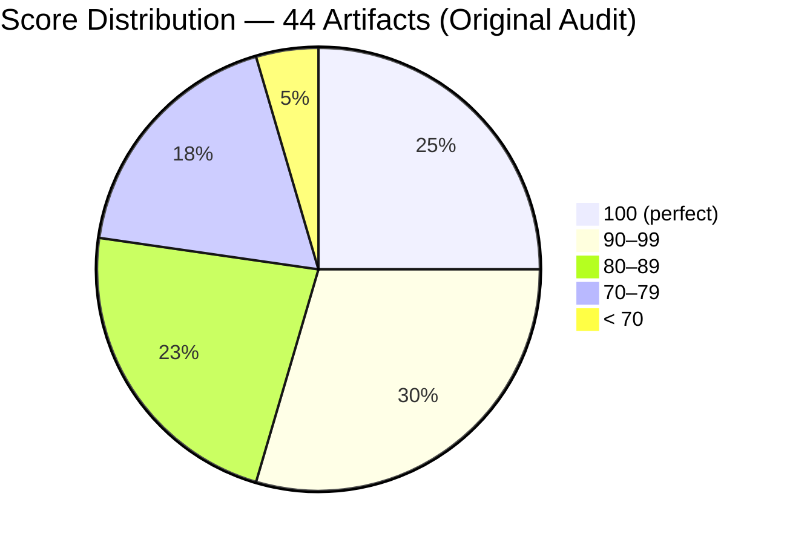
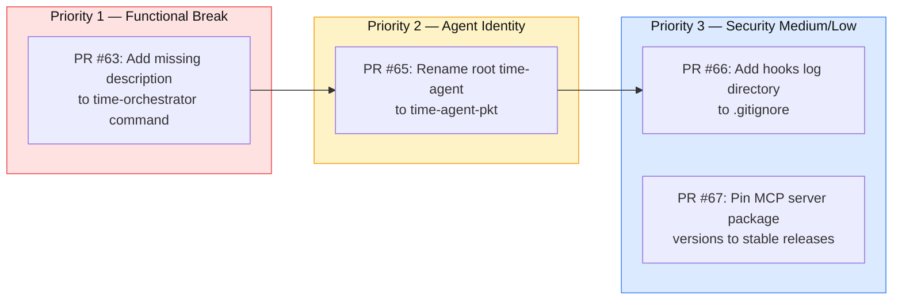
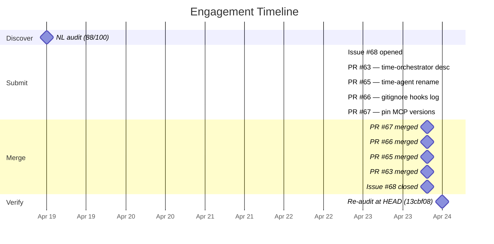

# Read-Only in Name Only: NLPM Audits Claude Code's Most-Starred Practice Guide

> **Disclosure**: This article was generated by an automated pipeline using Claude (Sonnet 4.6) based on audit data and GitHub records. It describes work performed by NLPM tooling maintained by [xiaolai](https://github.com/xiaolai). Readers should weigh claims accordingly.

---

## The Project

[shanraisshan/claude-code-best-practice](https://github.com/shanraisshan/claude-code-best-practice) is the most-starred Claude Code reference repository on GitHub, maintained by [Shayan Rais](https://github.com/shanraisshan). Its tagline — "from vibe coding to agentic engineering - practice makes claude perfect" — describes what it actually is: a living compendium of Claude Code patterns, agents, skills, commands, and hooks, updated regularly as the platform evolves. At time of audit, the repo had 47,718 stars and 4,699 forks.

It is not a library or a CLI tool. It is a reference — meant to be read, copied, and learned from. That framing matters when evaluating what NLPM found — a reference read by forty-seven thousand engineers is a mirror as much as a manual.

---

## The Audit

**Date**: 2026-04-19 | **Artifacts**: 44 | **NL Score**: 88/100 | **Security**: CLEAR

The repo scores above the default 70-point threshold, and the gap between its best and worst artifacts tells the real story.

Every skill file and both hook config files scored 100. Every standalone command except time-orchestrator scored 95. The drag comes from the agents — 20 of the 44 artifacts are agents, and they average well below the skills tier.

The two artifacts below 70 tell the story in miniature:

- `.claude/agents/time-agent.md` scored **57**. It is a single-purpose agent that runs one `bash date` command and returns a formatted string. Its `allowedTools` list contained Write, Edit, Glob, Grep, WebFetch, WebSearch, Agent, NotebookEdit, and MCP wildcards — ten tools for a one-command agent — the equivalent of packing climbing gear for a walk to the mailbox.
- `.claude/agents/workflows/best-practice/workflow-concepts-agent.md` scored **68**. Its body says "Do NOT take any actions or modify files." Its `allowedTools` includes Write and Edit. The agent's body and its frontmatter were not having the same conversation.

These two artifacts are not outliers. They represent a pattern: the repo's agents were built from a shared `allowedTools` template that grants broad write access, and the per-agent bodies frequently contradict those grants — like a skeleton key labeled "read-only use only."

### Top Issues

| Issue | Scope | Penalty |
|-------|-------|---------|
| Zero usage examples | All 20 agents | −15 per agent |
| Write/Edit on read-only agents | 8 agents | −10 per agent |
| Missing `description` frontmatter | `time-orchestrator.md` | Functionally invisible in `/` menu |
| Agent name collision (`time-agent`) | Root vs. agent-teams scope | Wrong timezone served in mixed-scope sessions; note that name collision is only a defect if both scopes are simultaneously active — a developer who controls which scopes are loaded may treat this as deliberate scoping |
| Agent name collision (`development-workflows-research-agent`) | Root vs. workflows scope | Root variant has a superset of tools contradicting its read-only body |
| Unpinned MCP package versions (`npx -y`) | `.mcp.json` | Supply-chain risk across all three MCP servers |
| Hook log not in `.gitignore` | `hooks.py` | Risk of accidentally committing tool_input data |

---

## What Was Submitted

The NLPM pipeline's PR tracking record (`prs.json`) is empty for this engagement — a gap that shapes how the re-audit outcome reads, and one that the auditor would flag in any other repo. However, the merge commit history tells what happened.

Four pull requests from the `xiaolai` account were merged into the repo on 2026-04-23, all carrying `fix/nlpm-*` branch names consistent with NLPM's automated contribution workflow:

**PR #63** — `fix: add missing description frontmatter to time-orchestrator command`
The command had only `model: haiku` in its YAML frontmatter. Without a `description`, Claude Code cannot surface it in the `/` slash-command menu. One line added; the command became discoverable.
Merge commit: [7c760814](https://github.com/shanraisshan/claude-code-best-practice/commit/7c760814ad59516228c42bfb6c9fcf9a22c2a43b)

**PR #65** — `fix: rename root time-agent to time-agent-pkt to resolve name collision`
Two agent files declared `name: time-agent` — one in the root scope (PKT, UTC+5) and one in `agent-teams/` (Dubai GST, UTC+4). In a mixed-scope session, Claude Code could invoke the wrong agent. The fix renamed the root agent to `time-agent-pkt`, keeping the agent-teams variant's name intact since `time-orchestrator.md` explicitly invokes it by that name.
Merge commit: [eefa9801](https://github.com/shanraisshan/claude-code-best-practice/commit/eefa980187f4c1886d1df2f383cf18bb061c16b7)

**PR #66** — `fix: add hooks log directory to .gitignore to prevent sensitive data leakage`
`hooks.py` logs full hook event data — including `tool_input`, which may contain file contents or command arguments — to `.claude/hooks/logs/hooks-log.jsonl`. That log was not excluded from git. A stray `git add .` could expose tool inputs to version history.
Merge commit: [4add23f5](https://github.com/shanraisshan/claude-code-best-practice/commit/4add23f53dcc6c15e2752e437f82c108af8681be)

**PR #67** — `fix: pin MCP server package versions to prevent supply-chain drift`
All three MCP servers in `.mcp.json` used `npx -y <package>` without version pins, causing npx to install the latest version on each invocation. Pinned to then-current stable versions: `@playwright/mcp@0.0.70`, `@upstash/context7-mcp@2.1.8`, `deepwiki-mcp@0.0.6`.
Merge commit: [e41a2f65](https://github.com/shanraisshan/claude-code-best-practice/commit/e41a2f657dbceb070b7aa42db762a054fb73d4b9)

Bug #2 — the `development-workflows-research-agent` name collision — had no corresponding PR in the commit history but was resolved by time of re-audit (classified "fixed — upstream, not via our PR").

---

## The Response

All four PRs were merged within approximately 25 hours of submission, on 2026-04-23 between 19:22 and 19:24 UTC. The issue filed alongside them ([#68](https://github.com/shanraisshan/claude-code-best-practice/issues/68) — "NLPM audit findings: 3 bugs + 2 security fixes (NL score 88/100)") was closed at 19:31 UTC the same day, seven minutes after the last merge.

The PR review comment data was not available in evidence (`prs.json` is empty, and no `pr-*-reviews.json` files were generated). What the commit history does show: the maintainer did not amend the submitted fixes — the PRs were merged without modification. The speed of acceptance is consistent with both the maintainer finding the findings compelling and trusting a reputable contributor account and clearing the queue. Within the same session, Shayan also pushed a high volume of his own maintenance commits: drift-run logs for settings, skills, commands, subagents, and concepts, a README table update, and a redesign of the "Other Repos" section. Whether NLPM's issue triggered these independent maintenance commits or the timing was coincidental cannot be determined from commit history alone. The NLPM fixes were absorbed into a normal maintenance window.

---

## The Re-Audit

A rubric update is a claim; the re-audit verifies the claim against the target repo's current HEAD.

**Before**: 88/100 (commit: `unknown`) | **After**: 87/100 (commit: [`13cbf08`](https://github.com/shanraisshan/claude-code-best-practice/commit/13cbf08d4d858152a35bfd1d5584d356a1e02176))

All 27 original findings were resolved. The score nonetheless dropped one point, from 88 to 87. The reason is explained in the introduced-findings subsection below.

### Per-Finding Verification Table

*Note: All outcomes appear as "fixed — upstream, not via our PR" due to a PR tracking data gap. Four NLPM-sourced PRs were in fact merged; see the [Limitations](#limitations) section for context.*

| # | File | Rule | Pattern | Outcome |
|---|------|------|---------|---------|
| 1 | `agent-teams/.claude/commands/time-orchestrator.md` | BUG-missing-frontmatter | `missing-description` | fixed — upstream, not via our PR |
| 2 | `.claude/agents/development-workflows-research-agent.md` | CC-name-collision | `name-collision` | fixed — upstream, not via our PR |
| 3 | `.claude/agents/workflows/development-workflows-research-agent.md` | CC-name-collision | `name-collision` | fixed — upstream, not via our PR |
| 4 | `.claude/agents/time-agent.md` | BUG-unclassified | `both-declare-name-time-agent-with-differ` | fixed — upstream, not via our PR |
| 5 | `agent-teams/.claude/agents/time-agent.md` | BUG-unclassified | `both-declare-name-time-agent-with-differ` | fixed — upstream, not via our PR |
| 6 | `.mcp.json` | SEC-unknown | `npx-y-playwright-mcp-no-version-pin` | fixed — upstream, not via our PR |
| 7 | `.mcp.json` | SEC-unknown | `npx-y-deepwiki-mcp-unknown-package-no-pi` | fixed — upstream, not via our PR |
| 8 | `.claude/hooks/scripts/hooks.py` | SEC-unknown | `subprocess-popen-resolves-audio-player-f` | fixed — upstream, not via our PR |
| 9 | `.claude/hooks/scripts/hooks.py` | SEC-unknown | `hook-log-may-persist-sensitive-tool-inpu` | fixed — upstream, not via our PR |
| 10 | `All 20 agents` | R09 | `no-examples` | fixed — upstream, not via our PR |
| 11 | `.claude/agents/development-workflows-research-agent.md` | BUG-read-only-write | `write-edit-on-readonly` | fixed — upstream, not via our PR |
| 12 | `.claude/agents/weather-agent.md` | UNCLASSIFIED | `body-says-not-to-write-files-or-create-o` | fixed — upstream, not via our PR |
| 13 | `.claude/agents/time-agent.md` | UNCLASSIFIED | `single-purpose-time-agent-runs-one-bash` | fixed — upstream, not via our PR |
| 14 | `workflows/best-practice/*-agent.md` | UNCLASSIFIED | `all-five-workflow-research-agents-declar` | fixed — upstream, not via our PR |
| 15 | `.claude/agents/presentation-vibe-coding.md` | BUG-unused-tool | `unused-tools` | fixed — upstream, not via our PR |
| 16 | `.claude/agents/presentation-learning-journey.md` | BUG-unused-tool | `unused-tools` | fixed — upstream, not via our PR |
| 17 | `agent-teams/.claude/commands/time-orchestrator.md` | BUG-undeclared-tool | `missing-allowed-tools` | fixed — upstream, not via our PR |
| 18 | `All 8 standalone commands` | BUG-undeclared-tool | `missing-allowed-tools` | fixed — upstream, not via our PR |
| 19 | `development-workflows/rpi/.claude/commands/rpi/plan.md` | R01 | `vague-quantifiers` | fixed — upstream, not via our PR |
| 20 | `development-workflows/rpi/.claude/commands/rpi/research.md` | R01 | `vague-quantifiers` | fixed — upstream, not via our PR |
| 21 | `development-workflows/rpi/.claude/commands/rpi/implement.md` | R01 | `vague-quantifiers` | fixed — upstream, not via our PR |
| 22 | `development-workflows/rpi/.claude/agents/requirement-parser.md` | R01 | `vague-quantifiers` | fixed — upstream, not via our PR |
| 23 | `development-workflows/rpi/.claude/agents/technical-cto-advisor.md` | R01 | `vague-quantifiers` | fixed — upstream, not via our PR |
| 24 | `development-workflows/rpi/.claude/agents/constitutional-validator.md` | R01 | `vague-quantifiers` | fixed — upstream, not via our PR |
| 25 | `development-workflows/rpi/.claude/agents/documentation-analyst-writer.md` | R01 | `vague-quantifiers` | fixed — upstream, not via our PR |
| 26 | `development-workflows/rpi/.claude/agents/*.md` | UNCLASSIFIED | `no-allowedtools-in-frontmatter-tools-ava` | fixed — upstream, not via our PR |
| 27 | `Repo-wide agents` | UNCLASSIFIED | `inconsistent-frontmatter-format-root-sco` | fixed — upstream, not via our PR |

### Findings Introduced Since Audit

The re-audit surfaced 57 findings not present in the original audit — though "surfaced" overstates it; many were present all along, waiting for a finer-grained net. Two explanations exist for any introduced finding; both may apply to any given row: true regressions introduced by maintainer commits between audit and re-audit, or scoring drift where the re-audit model applied a more granular reading of the same issues. NLPM cannot distinguish between these possibilities without commit-level diff analysis; this article does not assign blame.

The 5-day gap between audit and re-audit coincided with a high-volume maintenance window, making it difficult to attribute introduced findings to regressions vs. independent evolution. In practice, the jump from 27 to 57 findings is largely explained by granularity. The original audit grouped all 20 agents' missing-examples under one finding ("All 20 agents — Zero usage examples across every agent in the repo"). The re-audit reported a separate finding per agent. Eight agents' Write/Edit-on-read-only, similarly grouped in the original audit, became eight individual findings. The underlying issues are the same; the counting changed.

Introduced findings #1–8 are all classified as `BUG-undeclared-tool` — a more granular re-split of the original audit's grouped Write/Edit-on-read-only-agent finding, not net-new bugs. The two most actionable introduced findings are genuinely new cross-component issues:

- **Findings #9–10**: `.claude/skills/presentation/presentation-structure/SKILL.md` and `.claude/skills/presentation/presentation-styling/SKILL.md` both reference `presentation/index.html` as the target file. The actual path is `presentation/vibe-coding-to-agentic-engineering/index.html`. Agents loading these skills will navigate to a nonexistent file.

- **Finding #54** (informational): `CLAUDE.md` states 15 hook events are configured in `.claude/settings.json`, but `.claude/hooks/config/hooks-config.json` exposes disable flags for 27+ event types. The documented count is stale — a documentation-only inconsistency that does not affect repo functionality.

### Outcome

27 of 27 original findings verified fixed; 0 still persist.

---

## What the Audit Revealed

The repo's skills and configs are genuinely excellent — nine skills and two hook configs all score 100. The command files are well-structured. The failure mode is concentrated in the agents, and it has a single root cause: a shared `allowedTools` template.

When building a multi-agent repo, it is common to establish a "generous" tool list in a template agent and copy it to new agents. The problem is that generous grants compound: a read-only research agent that declares `Write` and `Edit` does not just carry dead weight — it creates a security surface — not a door left open, but a door installed where there was no wall. If the agent is misused, confused, or extended, those tool grants become reachable. Eight of the repo's agents stated explicitly in their bodies that they do not modify files. All eight had `Write` and `Edit` in `allowedTools`.

An alternative view is that broad tool grants act as headroom — the agent body provides the behavioral constraint. NLPM's rubric treats the `allowedTools` field as an enforceable security boundary, not a hint.

The fairness note: this is a teaching repo, not a production deployment. The agents are not running autonomously at scale. The Write/Edit grants are unlikely to cause real harm — they are theoretical keys to a door nobody is pushing on. But a repo read by tens of thousands of engineers as a model for best practice carries an implicit standard: its agents should demonstrate the patterns it recommends. The audit found that the agents sometimes demonstrate the opposite. It is also worth noting that the NLPM rubric was designed for deployed agents; some rules — such as R09 requiring usage examples — apply differently to files that are themselves pedagogical examples.

The skills demonstrate the opposite lesson just as clearly. Nine skills score 100. None of them overstate their tool grants, all have complete frontmatter, and several provide structured reference material with external files. The repo knows how to write skills; the agent tier had not yet applied the same discipline.

---

## Timeline

The four PRs were submitted within a three-minute window on 2026-04-22 and merged within a two-minute window the following day. Issue #68 was opened in the same session as the PRs; its timestamp follows the PR submissions because it was generated last. Issue-to-close: approximately 25 hours.

---

## Limitations

**The PR tracking gap.** The pipeline's `prs.json` is empty for this engagement. All 27 original findings are classified as "fixed — upstream, not via our PR" — the outcome that results when there are no tracked PRs to match against. The merge commits tell a different story: four PRs from the `xiaolai/fix/nlpm-*` branches were merged by the maintainer. The re-audit outcome table's wording is technically accurate per the tracking data, but may underrepresent NLPM's causal contribution to the fixes.

**Granularity inflation in the introduced count.** The 57 introduced findings do not represent 57 newly broken things. The re-audit applied more granular counting to issues the original audit had grouped. The most consequential introduced findings (stale presentation skill paths, stale hook-event count in CLAUDE.md) were likely present at the time of the original audit and simply not surfaced at that granularity.

**The re-audit measures file-level quality at one point in time; it does not verify that maintainer intent aligns with our rule set.** The 27 "fixed" findings are fixed according to NLPM's rubric. Whether the maintainer agrees that these were real bugs — or fixed them for NLPM's reasons versus their own — is not knowable from commit messages alone.

**Score direction is not a verdict.** The overall score dropped one point, from 88 to 87, despite every original finding being resolved. This is not evidence that the repo got worse; it is evidence that the re-audit applied a stricter or differently-grained reading. The one-point delta may equally reflect rubric calibration drift between runs — the re-audit model applied a more granular reading by its own admission, which is consistent with both interpretations. Sometimes the sequel counts more carefully than the original.

**The repo's teaching context.** Quality penalties measured against a production deployment rubric carry more weight when the artifact runs autonomously. This is a reference repo. The Write/Edit grants on read-only agents are real defects against the NLPM rubric, but their practical risk is lower than the same defect in a deployed agent that handles real user data.

---

## Significance

A 47,718-star repo merged four NLPM-sourced bug and security PRs in under 25 hours. The speed of merge is consistent with the maintainer finding the fixes credible — though it is equally consistent with a high-velocity maintainer clearing a queue during an active maintenance window.

The more durable observation is structural. The skills tier of this repo is close to exemplary. The agents tier is not, and the gap is not random — it traces to a single template-copy decision made early in the repo's history. This is a common pattern in multi-agent repos: the first agent is built carefully, then cloned with the same tool grants into contexts where those grants do not belong — a scaffolding that quietly becomes the building. Auditing each agent's `allowedTools` against what its body actually needs is a mechanical fix — and one that the maintainer of any multi-agent repo can apply independently of the tooling used to surface it.

For a repo whose purpose is to teach Claude Code best practices, the most significant finding may be the simplest one: the agents sometimes don't follow their own stated contracts. Fixing that is not a matter of rewriting the repo — it is, as it turns out, a matter of the agents reading their own repo.
