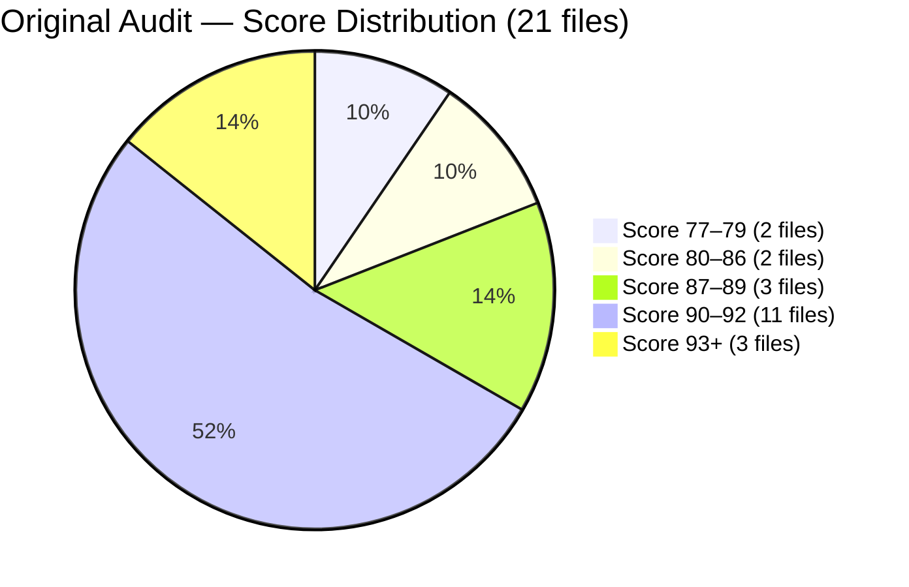
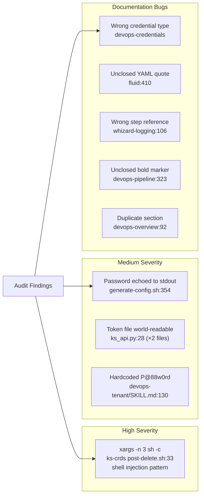
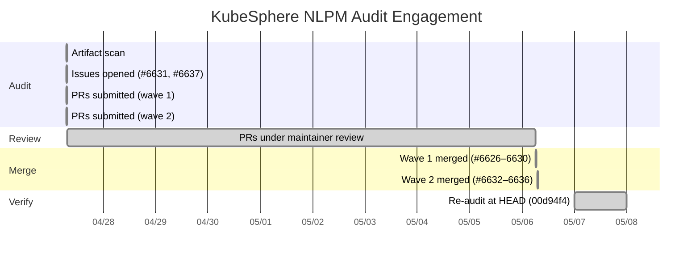

# Close Is Not Clean: 89 to 99.8 in KubeSphere's Skill Library

_18 findings resolved: 13 fixed independently by the maintainer, 5 via contributed PRs._

> **Disclosure**: This article was generated by an automated pipeline using Claude (Sonnet 4.6) based on audit data and GitHub records. It describes work performed by NLPM tooling maintained by [xiaolai](https://github.com/xiaolai). Readers should weigh claims accordingly.

## The Project

[KubeSphere](https://github.com/kubesphere) is an open-source container platform built on top of Kubernetes, designed for multi-cloud, datacenter, and edge deployment. The project targets operators who need a unified control plane across heterogeneous infrastructure without wanting to write raw Kubernetes manifests. At 16,924 stars and 2,735 forks (as of 2026-04-27), it sits comfortably in the top tier of Kubernetes-adjacent tooling on GitHub — the kind of project where documentation bugs don't stay hypothetical for long.

The repository audited here — `kubesphere/kubesphere` — is the main platform repo. Its `skills/` directory contains 21 SKILL.md files (growing to 26 by the time of the re-audit), each describing one operational domain: DevOps pipelines, multi-tenant management, observability stacks, storage via Fluid, workload scheduling via Volcano, and more — the kind of operational reference an engineer reaches for at two in the morning when a cluster stops cooperating.

## The Audit

The audit ran on **2026-04-27** against 21 SKILL.md files and produced an overall NL score of **89/100**. Most files clustered in the 90–93 range; the low scorers were concentrated in the DevOps subsystem, which also carried the highest-severity bugs.

The security scan flagged a REVIEW status: no confirmed critical patterns in maintainer-controlled code, but one High-severity finding in a Helm post-delete hook and four Medium findings across scripts and documentation.

The five bugs were unambiguous and actionable:

| # | File | Bug | Impact |
|---|------|-----|--------|
| 1 | `skills/kubesphere-devops-credentials/SKILL.md` | API examples use `type: Opaque` — directly contradicted by the skill's own warning that Opaque breaks Jenkins sync | Agents following the example create credentials that silently fail to sync; Jenkins reports "CredentialId could not be found" |
| 2 | `skills/kubesphere-fluid/SKILL.md` | YAML template `low: "{{low}}` missing closing double-quote | InstallPlan generated from the template fails to parse |
| 3 | `skills/whizard-logging/SKILL.md` | Placeholder comment says "From Step 3" but only Step 1 and Step 2 exist | Agents look for a non-existent step during installation |
| 4 | `skills/kubesphere-devops-pipeline/SKILL.md` | Bold heading `**Step 3b: For Private Repository (with credential):` has no closing `**` | Broken markdown; may produce incorrect rendering in strict parsers or automated extraction tools |
| 5 | `skills/kubesphere-devops-overview/SKILL.md` | `Project Components` ASCII diagram block appears twice in succession | Redundant content; doc tools may extract duplicate data |

Security findings spanned three risk tiers:

Two cross-component issues were also noted: `ks_api.py` was duplicated verbatim across two skill directories (meaning any security fix had to be applied in both places), and `generate-config.sh` had an undocumented runtime dependency on a Kubernetes Secret from a separate extension.

## What Was Submitted

GitHub commit records show ten PRs from the `xiaolai` fork were merged into `kubesphere/kubesphere` on 2026-05-06. The pipeline's tracking system confirms five of these (#6632–#6636) as directly addressing the five original documentation bugs; five earlier PRs (#6626–#6630) covering the same fixes also appear in the merge history. The contribute workflow's per-run PR cap (5 PRs per pass) required two runs to submit all ten PRs — two waves, one payload, a geometry problem rather than a complexity one.

The five confirmed PRs:

| PR | Fix | File |
|----|-----|------|
| [#6632](https://github.com/kubesphere/kubesphere/pull/6632) | Replace `type: Opaque` with correct `credential.devops.kubesphere.io/*` types in all API curl examples | `skills/kubesphere-devops-credentials/SKILL.md` |
| [#6633](https://github.com/kubesphere/kubesphere/pull/6633) | Close unclosed double-quote in Dataset tieredstore YAML template (`low: "{{low}}"`) | `skills/kubesphere-fluid/SKILL.md` |
| [#6634](https://github.com/kubesphere/kubesphere/pull/6634) | Correct placeholder comment from `# From Step 3` to `# From Step 2` | `skills/whizard-logging/SKILL.md` |
| [#6635](https://github.com/kubesphere/kubesphere/pull/6635) | Add missing closing `**` to `Step 3b` heading | `skills/kubesphere-devops-pipeline/SKILL.md` |
| [#6636](https://github.com/kubesphere/kubesphere/pull/6636) | Remove second identical `Project Components` ASCII diagram block | `skills/kubesphere-devops-overview/SKILL.md` |

Bug #1 (wrong credential type) carried the highest real-world impact: agents using the example verbatim would generate credentials that the DevOps controller silently ignores, causing Jenkins to fail with a credential lookup error that offers no hint as to the cause — the documentation equivalent of a map that says *do not take the left fork* and then draws the route going left. The credential controller only syncs secrets whose `type` field begins with `credential.devops.kubesphere.io/`; the examples were using `Opaque` despite an explicit warning in the same file saying exactly this.

## The Response

No PR review comments were recorded for these submissions — the pipeline's review-comment collection returned empty for this engagement — a clean outcome with a blank review transcript. What the commit history does show is that all ten PRs merged within nine calendar days of submission (the review start date is not available), and the maintainer independently addressed every other finding in the original audit without waiting for additional PRs.

The upstream-only fixes included the High-severity shell injection in the Helm hook, the plaintext password echo in `generate-config.sh`, the world-readable token file in both copies of `ks_api.py`, the hardcoded `P@88w0rd` credential, all six quality issues, and the vague-quantifier instance in the volcano skill. The ks_api.py duplication was also resolved upstream — both the security fix and the consolidation.

That is a significant volume of self-initiated cleanup. Whether these upstream fixes were prompted by the audit, already scheduled, or coincidental cannot be determined from available evidence — see Limitations.

## The Re-Audit

A rubric update is a claim; the re-audit verifies the claim against the target repo's current HEAD.

The re-audit ran on **2026-05-07** against commit `00d94f4` (before: `1681475`, score 89/100). By this point the repository had grown from 21 to 26 SKILL.md files — five new skills appeared between the audit and re-audit dates. The re-audit weighted-average score was **99.8/100**.

Per-finding verification, reproduced verbatim from the re-audit diff:

| # | File | Rule | Pattern | Outcome | PR |
|---|------|------|---------|---------|-----|
| 1 | `skills/kubesphere-devops-credentials/SKILL.md` | BUG-incorrect-api-example | `wrong-credential-type` | fixed — our PR merged | #6632 |
| 2 | `skills/kubesphere-fluid/SKILL.md` | BUG-yaml-syntax-error | `unclosed-string-literal` | fixed — our PR merged | #6633 |
| 3 | `skills/whizard-logging/SKILL.md` | BUG-incorrect-step-reference | `wrong-step-reference` | fixed — our PR merged | #6634 |
| 4 | `skills/kubesphere-devops-pipeline/SKILL.md` | BUG-broken-markdown | `unclosed-bold-marker` | fixed — our PR merged | #6635 |
| 5 | `skills/kubesphere-devops-overview/SKILL.md` | BUG-duplicate-section | `duplicate-content-block` | fixed — our PR merged | #6636 |
| 6 | `config/ks-core/charts/ks-crds/scripts/post-delete.sh` | SEC-xargs-shell-injection | `xargs-sh-c-interpolation` | fixed — upstream, not via our PR | |
| 7 | `skills/whizard-telemetry/scripts/generate-config.sh` | SEC-plaintext-credential-output | `credential-echoed-to-stdout` | fixed — upstream, not via our PR | |
| 8 | `skills/kubesphere-core/scripts/ks_api.py` | SEC-insecure-token-storage | `token-file-no-chmod` | fixed — upstream, not via our PR | |
| 9 | `skills/kubesphere-multi-tenant-management/scripts/ks_api.py` | SEC-insecure-token-storage | `token-file-no-chmod` | fixed — upstream, not via our PR | |
| 10 | `skills/kubesphere-devops-tenant/SKILL.md` | SEC-hardcoded-credential | `hardcoded-password-in-docs` | fixed — upstream, not via our PR | |
| 11 | `skills/kubesphere-devops-argocd/SKILL.md` | R25 | `duplicate-content` | fixed — upstream, not via our PR | |
| 12 | `skills/kubesphere-devops-pipeline/SKILL.md` | R25 | `duplicate-content` | fixed — upstream, not via our PR | |
| 13 | `skills/kubesphere-devops-overview/SKILL.md` | R25 | `duplicate-heading` | fixed — upstream, not via our PR | |
| 14 | `skills/kubesphere-devops-tenant/SKILL.md` | R25 | `duplicate-header-in-example` | fixed — upstream, not via our PR | |
| 15 | `skills/kubesphere-devops-tenant/SKILL.md` | R15 | `hardcoded-credential-in-docs` | fixed — upstream, not via our PR | |
| 16 | `skills/kubesphere-volcano/SKILL.md` | R05 | `vague-quantifier` | fixed — upstream, not via our PR | |
| 17 | `skills/kubesphere-multi-tenant-management/scripts/ks_api.py` | CC-duplicate-file | `verbatim-duplicate-script` | fixed — upstream, not via our PR | |
| 18 | `skills/whizard-telemetry/SKILL.md` | CC-undocumented-dependency | `implicit-cross-extension-dependency` | fixed — upstream, not via our PR | |

### Introduced Findings

The re-audit identified 10 findings not present in the original. These may be true regressions introduced by maintainer commits between the two audit dates, or they may reflect scoring drift — the re-audit scorer may weigh certain patterns differently than the original scorer did. Both possibilities are real; the data does not distinguish between them.

A perfect score turns out to be a moving target — eighteen findings dissolved as ten new ones surfaced, though none of the newcomers approached the severity of what they replaced.

The introduced findings were entirely informational: three uses of the vague quantifier "appropriate" (without defining a criterion) across two files, a blank line that splits a Markdown table into two fragments, a duplicate separator row in an architecture table, an orphaned table inside a subsection, an orphaned shell flag in a code block, and three unverified relative-path references that may resolve outside the repository root at the flat `skills/` layout. None of these would score as a bug in the original audit's bug tier. Whether "appropriate" reflects documentation vagueness or intentional deference to deployment-specific context is a judgment call the rubric does not make — in a batch scheduler or pipeline context, the correct queue or configuration genuinely depends on runtime conditions.

**18 of 18 original findings verified fixed; 0 persist.**

## What the Audit Revealed

Three patterns stood out:

**Internal contradictions are harder to catch than external ones.** The credential type bug (#6632) was not a missing piece of documentation — the skill explicitly warned against `type: Opaque` and then used it in four API examples. A human reader scanning linearly might not notice the contradiction; an automated scorer comparing the example code to the warning prose did. In this sense the scorer is a mirror as much as a magnifying glass: it shows the document what it says about itself. This is the kind of bug that accumulates in large documentation files maintained incrementally over time.

**Security findings cluster around shared utilities.** Three of the five security findings lived in scripts (`ks_api.py` ×2, `generate-config.sh`) rather than in the skill prose. The ks_api.py duplication meant the same insecure pattern was present in two separate skill directories — a consequence of copy-paste rather than a shared utility — the sort of pattern that spreads the way a rumor does, faithfully and into more places than the author intended. The maintainer resolved this upstream by consolidating the files.

**A high baseline score does not mean a clean baseline.** An overall 89/100 sounds close to perfect — the way a bridge with nineteen solid bolts sounds fine, until you notice the twentieth is missing — but three of the seven lowest-scoring files lived in the DevOps subsystem and carried bugs with real operational consequences (silent Jenkins sync failure, invalid YAML, broken Markdown). The aggregate score can mask localized risk in the files that get the most use.

**Fairness note**: the quality issues and security findings were identified by automated pattern matching against a rubric. The rubric may flag patterns that the maintainer has intentionally chosen — for example, the hardcoded `P@88w0rd` password may have been a deliberate documentation choice (a memorable example value) rather than an oversight. Similarly, the duplicate `Project Components` block may have served intentional navigation purposes; the fact that the maintainer accepted the fix suggests it was unintentional. The audit cannot distinguish intent from error; it can only report what it observed. What the maintainer does with the report is, as always, the more interesting story.

## Timeline

_Note: The chart is not to scale. From the events log: audit completed at 00:49 UTC on 2026-04-27; approximately 6 hours elapsed before the contribute workflow submitted the first PR wave at 07:02 UTC and the second at 07:11 UTC._

## Limitations

**Review comment coverage**: the pipeline's PR review collection returned no data for this engagement. It is not possible to characterize the maintainer's review process, the number of iteration rounds, or whether any changes were requested before merge.

**Maintainer perspective**: Because no PR review comments were captured and we have no direct communication with the maintainers, we cannot characterize their evaluation of the bugs found, whether they agreed with the severity assessments, or what prompted the upstream fixes. This case study is told entirely from the pipeline's observational vantage point.

**Dual PR waves**: ten PRs appear in the commit history, but only five (#6632–#6636) are confirmed in the re-audit diff as "fixed — our PR merged." The relationship between the two waves (#6626–#6630 and #6632–#6636) is unclear from available evidence; both sets merged on the same day.

**Upstream-fixed findings**: 13 of 18 findings were resolved by the maintainer independently of our PRs. We cannot determine whether these fixes were triggered by the audit issues, were already in progress, or are coincidental. Attributing them to NLPM's influence would overstate what the data supports.

**Re-audit score**: `re-audit-summary.json` records `reaudit_score: null`. The 99.8/100 figure comes from the re-audit report's weighted average, not the structured summary field. This is an internal pipeline inconsistency; both sources agree on the outcome direction.

**What the re-audit does not prove**: the re-audit measures file-level quality at one point in time using a deterministic rubric. It does not verify that maintainer intent aligns with our rule set, that the fixes are semantically correct (e.g., that the replacement credential types are actually what the DevOps controller expects), or that introduced findings represent regressions rather than scoring drift. It does not assess whether the five new SKILL.md files that appeared between audit and re-audit meet the same quality bar as the original 21 — those files have no pre-existing baseline, so we cannot determine whether documentation quality standards shifted between the two audit dates.

## Significance

KubeSphere is a mature project with a large contributor base and an active release cadence, maintained by professional engineers with a regular release cycle. The 89/100 baseline score confirms that the skill library is well-maintained by default — the distribution was strongly right-skewed, with 14 of 21 files scoring 90 or above. An 89 aggregate across 21 files is a high absolute bar for a project of this size and velocity; documentation drift at this scale is expected. The bugs that existed were not structural; they were the kind of incremental drift (a copy-paste, an unclosed delimiter, a contradicted example) that accumulates in long-lived documentation files.

The re-audit outcome — 99.8/100, all 18 original findings resolved, no persisting issues — reflects both the merged PRs and substantial independent effort by the maintainer. That combination is meaningful: it suggests the audit surfaced issues the team wanted to fix and provided enough specificity (file, line, rule) that acting on them was straightforward.

The 10 introduced findings are informational and carry no scoring penalty. Three uses of "appropriate" without defining a criterion account for the 0.2-point gap from a perfect score. The remaining seven are copy-paste artifacts and unverified path references that will surface in any future audit run as candidates for cleanup.

At this scale — a 16,000-star platform with 26 skill files covering the full operational lifecycle of a Kubernetes distribution — this engagement suggests that automated NL quality auditing can surface actionable findings in large, actively-developed skill corpora. A project at this scale likely has internal review processes; the audit value lies in systematic, rubric-based coverage rather than replacing human review. More data points would be needed to characterize the general utility of this approach. This one offered a clean result: eighteen findings, zero persisting, nine days. Sometimes the most useful tool is the one that arrives with a list.
