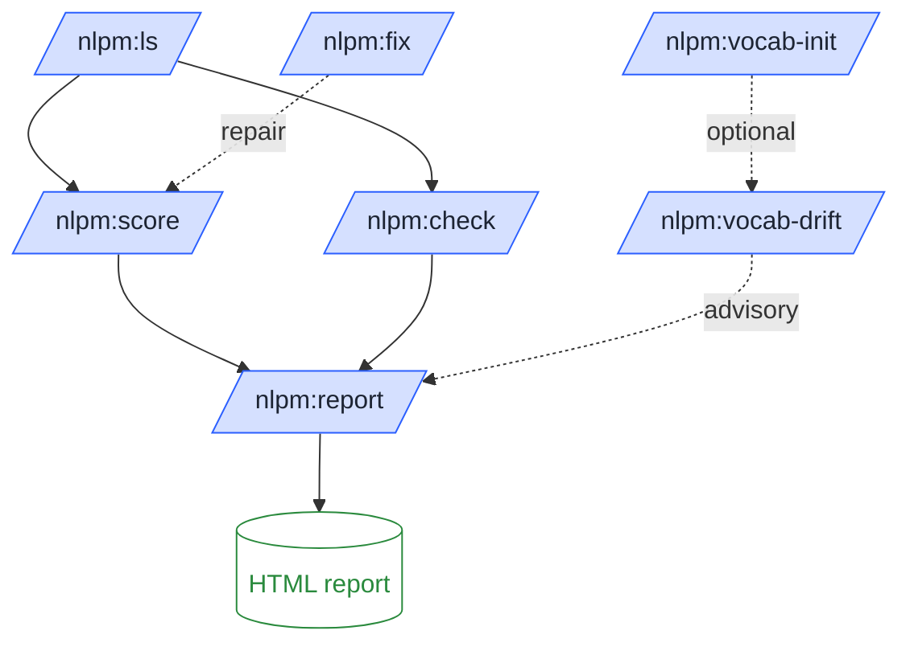
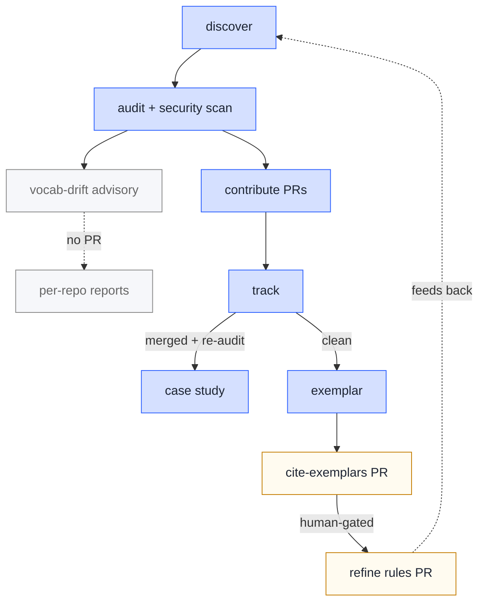
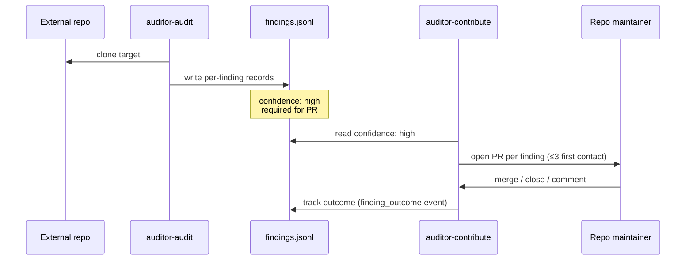

# How NLPM works

Two pipelines, one rulebook. The **local pipeline** is what a plugin author runs in their own repository; the **auditor pipeline** is what NLPM runs continuously against public Claude Code plugins on GitHub.

## Local pipeline (run in your repo)

Every step writes a JSON snapshot under `.claude/nlpm-history.json` so `/nlpm:trend` and `/nlpm:report` can chart progress over time.[^1]

## Auditor pipeline (NLPM's own self-evolution loop)

Everything before *refine rules* is automated observation. Only `auditor-refine-rules` mutates NLPM's own rulebook, and only by opening a PR for a human reviewer.[^2]

## Findings flow

## Two scopes, one boundary

NLPM operates in two declared scopes[^3]. The boundary is intentional: same verb name can mean different things across scopes, and that's a documented homonym, not a collision.

| Scope | What it operates on | Where it lives |
|-------|---------------------|----------------|
| **internal** | NLPM's own behavior — scoring, checking, fixing your local repo | `commands/`, `agents/`, `skills/`, hooks |
| **auditor** | External repos at scale | `.github/workflows/auditor-*.yml`, `auditor/` |

Cross-scope homonyms (`scan`, `test`, `discover`) mean the same thing in both scopes. Scope-bound verbs (`audit`, `contribute`, `track`) only make sense in the auditor scope. The [vocabulary reference](/reference/vocabulary) lists every term.

---

[^1]: Snapshots accumulate; `/nlpm:trend` reads them all to surface regressions over time. If you don't want history, delete `.claude/nlpm-history.json` between runs.

[^2]: This is by design — autonomous rule changes would create feedback loops between the auditor and its own rulebook. The human-gate is the cycle-breaker.

[^3]: The two-scope boundary is principle **P1** of the [vocabulary design principles](/reference/principles#P1). Cross-scope homonyms are *sanctioned* boundaries (declared explicitly in `registry.yaml`); accidental homonyms are flagged as drift by R51.
